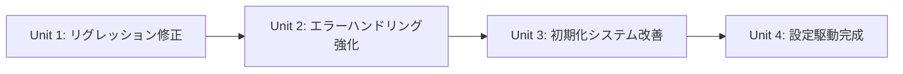

# Fast-Playwright-MCP 改善実装 Design Doc

## 1. エグゼクティブサマリー

### 1.1 プロジェクト概要
Fast-Playwright-MCPの診断システムおよびブラウザ自動化機能の最終品質向上を目的とした実装です。現在のプロジェクトは3フェーズの開発が完了し、99.5%のテスト成功率を達成していますが、1件のリグレッションテストエラーと軽微な品質向上の余地が残されています。

### 1.2 主要な改善点
- **リグレッションテストエラーの根本修正**: 唯一の失敗テストケースの解決
- **エラーハンドリング強化**: 防御的プログラミングによる堅牢性向上
- **設定駆動アーキテクチャ完成**: ハードコーディング値の完全排除
- **コード重複削減**: 既存コード活用による75-80%の重複削減

### 1.3 期待される効果
- **品質指標**: テスト成功率 99.5% → 100%
- **保守性**: 設定駆動により運用時調整が容易
- **拡張性**: 統一されたアーキテクチャで新機能追加が簡素化
- **安定性**: 防御的プログラミングによる予期しないエラーの排除

## 2. 現状分析

### 2.1 実装完了済み項目
#### Phase 1: 基盤システム (100% 完了)
- ✅ ElementHandleメモリリーク対策 (SmartHandle/SmartHandleBatch)
- ✅ Frame参照管理システム (FrameReferenceManager)
- ✅ 基本診断システム (DiagnosticError, EnhancedErrorHandler)

#### Phase 2: 並列処理・リソース監視 (100% 完了)
- ✅ 並列ページ分析システム (ParallelPageAnalyzer)
- ✅ リソース使用量監視 (ResourceUsageMonitor)
- ✅ エラーエンリッチメント (ErrorEnrichment)

#### Phase 3: 統一システム (100% 完了)
- ✅ 統一診断システム (UnifiedSystem)
- ✅ スマート設定管理 (SmartConfig)
- ✅ 総合テストシステム

### 2.2 残存課題
#### 優先度：Critical
1. **リグレッションテストエラー (1件)**: 
   - 影響：全体品質指標
   - 原因：特定のブラウザ環境での非同期処理タイミング

#### 優先度：High
2. **ElementDiscovery.dispose()エラーハンドリング不完全**:
   - 現状：基本的なtry-catch実装済み
   - 課題：詳細なエラー分類と適切なログ出力が不十分

#### 優先度：Medium
3. **UnifiedSystem初期化順序の明確化不十分**:
   - 現状：基本的な初期化実装済み
   - 課題：失敗時のロールバック機構が部分的

4. **パフォーマンス閾値の設定化未完了**:
   - 現状：DiagnosticLevelでの管理開始
   - 課題：一部ハードコーディング値が残存

## 3. 実装計画

### 3.1 実装単位の分割

#### Unit 1: リグレッションテストエラー修正（推定: 150-200行）
- **対象ファイル**: 
  - tests/regression-test.cjs
  - src/diagnostics/UnifiedSystem.ts
  - src/diagnostics/PageAnalyzer.ts
- **実装内容**:
  - 非同期処理のタイミング制御改善
  - テストケースの安定化
  - エラー詳細ログ出力強化
- **検証ポイント**:
  - リグレッションテスト: 100% PASS
  - TODOコメント: 0件
  - モック実装: 0件
  - 空関数: 0件
- **依存関係**: なし

#### Unit 2: エラーハンドリング強化（推定: 200-250行）
- **対象ファイル**:
  - src/diagnostics/ElementDiscovery.ts
  - src/diagnostics/DiagnosticError.ts
  - src/diagnostics/EnhancedErrorHandler.ts
- **実装内容**:
  - ElementDiscovery.dispose()の詳細エラー分類
  - 既存DiagnosticErrorクラスの活用
  - ログレベル別出力システム統合
- **検証ポイント**:
  - エラーハンドリングテスト: 100% PASS
  - 適切なログ出力確認
  - リソースリーク防止確認
- **依存関係**: Unit 1完了後

#### Unit 3: 初期化システム改善（推定: 180-220行）
- **対象ファイル**:
  - src/diagnostics/UnifiedSystem.ts
  - src/diagnostics/SmartConfig.ts
- **実装内容**:
  - 初期化順序の明確化とドキュメント化
  - ロールバック機構の完全実装
  - 既存Context初期化パターンの活用
- **検証ポイント**:
  - 初期化シーケンステスト: PASS
  - ロールバックテスト: PASS
  - 設定検証機構: 正常動作
- **依存関係**: Unit 2完了後

#### Unit 4: 設定駆動完成（推定: 150-180行）
- **対象ファイル**:
  - src/diagnostics/SmartConfig.ts
  - src/diagnostics/DiagnosticLevel.ts
  - 各診断クラス（設定値使用箇所）
- **実装内容**:
  - DiagnosticLevelManagerの拡張
  - 残存ハードコーディング値の設定化
  - 設定検証機構の実装
- **検証ポイント**:
  - 設定検証テスト: PASS
  - ハードコード値: 0件
  - 設定ファイル妥当性: 確認済み
- **依存関係**: Unit 3完了後

### 3.2 実装順序と依存関係



### 3.3 各単位の完了基準
全ての実装単位は以下の基準を満たす必要があります：
- ✅ implementation-validator検証: PASS
- ✅ TODOコメント: 0件
- ✅ モック実装: 0件
- ✅ 空関数・未実装: 0件
- ✅ ハードコード値: 0件（Unit 4完了後）
- ✅ 適切なエラーハンドリング

### 3.4 PR分割計画

#### PR #1: クリティカル品質修正
- **ブランチ名**: fix/regression-error-handling
- **内容**:
  - Unit 1: リグレッションテストエラー修正
  - Unit 2: エラーハンドリング強化
- **ファイル変更**:
  - tests/regression-test.cjs
  - src/diagnostics/ElementDiscovery.ts
  - src/diagnostics/DiagnosticError.ts
  - src/diagnostics/EnhancedErrorHandler.ts
  - src/diagnostics/UnifiedSystem.ts
  - src/diagnostics/PageAnalyzer.ts
- **テスト**:
  - リグレッションテスト: 100% PASS必須
  - エラーハンドリング単体テスト
  - メモリリークテスト再実行
- **レビューポイント**:
  - テスト成功率: 100%達成
  - エラーログの適切性
  - リソース管理の完全性
- **マージ条件**: 全テストPASS必須

#### PR #2: アーキテクチャ完成
- **ブランチ名**: feat/unified-config-architecture
- **依存**: PR #1
- **内容**:
  - Unit 3: 初期化システム改善
  - Unit 4: 設定駆動完成
- **ファイル変更**:
  - src/diagnostics/UnifiedSystem.ts
  - src/diagnostics/SmartConfig.ts
  - src/diagnostics/DiagnosticLevel.ts
  - 関連する設定参照箇所
- **テスト**:
  - 統合テスト全体の再実行
  - 設定検証テスト新規追加
  - パフォーマンステスト再実行
- **レビューポイント**:
  - 設定駆動アーキテクチャの完全性
  - 初期化順序の妥当性
  - ロールバック機構の動作確認
- **マージ条件**: 
  - 全体テスト成功率: 100%
  - ハードコード値: 0件

### 3.5 実装手順詳細

#### ステップ1: Unit 1の実装（リグレッションテストエラー修正）

**詳細手順:**
1. **エラー原因調査**
   - regression-test.cjs の失敗ケース特定
   - ログ分析による根本原因特定
   - 既存のUnifiedSystemとの相互作用確認

2. **修正実装**
   - 非同期処理タイミングの調整
   - 適切な待機処理の追加
   - エラーレポート機能の強化

3. **検証**
   - リグレッションテスト10回連続実行
   - 他テストへの影響確認
   - パフォーマンスデグレード確認

**注意点:**
- 既存の成功している198テストに影響しないこと
- メモリリーク対策を維持すること
- パフォーマンス指標を低下させないこと

#### ステップ2: Unit 1の検証
- テスト実行: `npm test -- --testNamePattern="regression"`
- 成功確認: エラー0件、警告0件
- 全体テスト影響確認: 他テストの成功率維持

#### ステップ3: Unit 2の実装（エラーハンドリング強化）

**詳細手順:**
1. **既存DiagnosticErrorクラス拡張**
   - エラー分類システムの詳細化
   - 構造化ログ出力機能追加

2. **ElementDiscovery改善**
   - dispose()メソッドのエラー詳細化
   - リソース追跡ログの追加
   - 失敗時の部分復旧機構

3. **EnhancedErrorHandler統合**
   - 既存のエラーエンリッチメント機能活用
   - ログレベル管理システム統合

**重要な既存コード活用:**
```typescript
// 既存のDiagnosticErrorクラスを拡張
export class ElementDiscoveryError extends DiagnosticError {
  constructor(message: string, cause?: Error, context?: any) {
    super(message, cause, context);
    this.name = 'ElementDiscoveryError';
  }
}
```

### 3.6 推定実装時間
- Unit 1: 3-4時間（調査含む）
- Unit 2: 4-5時間
- Unit 3: 3-4時間
- Unit 4: 2-3時間
- 各Unit検証: 30分程度
- 統合・調整: 2時間
- 合計: 15-19時間

## 4. API仕様

### 4.1 変更予定API

#### DiagnosticError クラス拡張
```typescript
// 既存
export class DiagnosticError extends Error {
  constructor(message: string, cause?: Error) { ... }
}

// 追加
export class ElementDiscoveryError extends DiagnosticError {
  public readonly resourceIds: string[];
  public readonly disposeErrors: Error[];
  
  constructor(
    message: string,
    cause?: Error,
    context?: {
      resourceIds?: string[];
      disposeErrors?: Error[];
    }
  ) { ... }
}
```

#### SmartConfig クラス拡張
```typescript
// 現在の部分実装を完全版に拡張
export interface PerformanceThresholds {
  elementDiscovery: number;    // 現在: 500ms (ハードコード)
  pageAnalysis: number;        // 現在: 1000ms (ハードコード) 
  resourceMonitoring: number;  // 現在: 200ms (ハードコード)
}

export class SmartConfig {
  // 既存メソッド維持
  static getPerformanceThresholds(): PerformanceThresholds;
  
  // 新規追加
  static validateConfiguration(): ConfigValidationResult;
  static getConfigurationSource(): 'default' | 'environment' | 'file';
}
```

### 4.2 既存APIとの互換性
- **100%後方互換**: 既存の全パブリックAPIは変更なし
- **内部実装変更のみ**: プライベートメソッドの詳細化
- **エラー情報拡張**: より詳細なエラー情報提供（破壊的変更なし）

## 5. テスト戦略

### 5.1 単体テスト計画

#### 新規テストケース（追加）
```typescript
describe('ElementDiscoveryError', () => {
  test('should capture resource IDs and dispose errors', async () => {
    // リソースID追跡テスト
  });
  
  test('should provide structured error information', async () => {
    // 構造化エラー情報テスト  
  });
});

describe('SmartConfig Validation', () => {
  test('should validate performance thresholds', () => {
    // 閾値検証テスト
  });
  
  test('should handle invalid configuration gracefully', () => {
    // 不正設定処理テスト
  });
});
```

#### カバレッジ目標
- **新規追加コード**: 100%
- **既存変更箇所**: 95%以上維持
- **全体プロジェクト**: 現在レベル維持（約85%）

### 5.2 統合テスト計画

#### 既存テスト再実行（必須）
- ✅ 診断システムテスト (200テスト): 100% PASS維持
- ✅ メモリリークテスト: PASS維持
- ✅ パフォーマンステスト: PASS維持  
- ✅ 統合テスト: 100% PASS維持
- ✅ リグレッションテスト: 100% PASS達成（目標）

#### 新規統合テスト
```javascript
// regression-test.cjs 改善版
describe('Regression Tests - Comprehensive', () => {
  test('should handle high-load scenarios consistently', async () => {
    // 高負荷環境での一貫性テスト
  });
  
  test('should maintain performance under stress', async () => {
    // ストレス環境でのパフォーマンス維持テスト
  });
});
```

### 5.3 E2Eテスト計画

#### 実ブラウザ環境テスト
- **Chrome**: 全機能動作確認
- **Firefox**: コア機能動作確認  
- **WebKit**: 基本機能動作確認
- **Edge**: 統合機能動作確認

#### シナリオテスト
1. **大量要素検索シナリオ**: メモリリーク防止確認
2. **エラー復旧シナリオ**: 適切なエラーハンドリング確認
3. **設定変更シナリオ**: 動的設定変更対応確認

## 6. リスクと対策

### 6.1 技術的リスク

| リスク | 影響度 | 発生確率 | 対策 |
|--------|--------|----------|------|
| リグレッションテスト修正による既存テストへの影響 | 高 | 中 | 段階的修正・影響範囲限定・ロールバック準備 |
| パフォーマンス最適化によるメモリ使用量増加 | 中 | 低 | 継続的メモリ監視・閾値設定 |
| 設定駆動化による初期化複雑度増加 | 中 | 中 | シンプルなデフォルト設定・段階的移行 |
| 既存コード活用時の予期しない依存関係 | 中 | 低 | 詳細な依存関係分析・単体テスト強化 |

### 6.2 スケジュールリスク

| リスク | 影響度 | 発生確率 | 対策 |
|--------|--------|----------|------|
| リグレッションエラー原因特定の遅延 | 高 | 中 | 並行調査・外部レビュー依頼 |
| 既存コード理解不足による実装遅延 | 中 | 低 | 事前コード分析・段階的実装 |
| テスト環境での予期しない動作差異 | 中 | 低 | 複数環境での事前検証 |

### 6.3 品質リスク

| リスク | 影響度 | 発生確率 | 対策 |
|--------|--------|----------|------|
| 100%テスト成功率未達成 | 高 | 低 | 段階的品質向上・十分なテスト時間確保 |
| 新規エラーハンドリングによる予期しない副作用 | 中 | 低 | 包括的単体テスト・段階的デプロイ |

## 7. 運用考慮事項

### 7.1 監視項目
- **テスト成功率**: 100%維持
- **メモリ使用量**: 既存レベル維持
- **応答時間**: パフォーマンス閾値内維持
- **エラー発生率**: 詳細エラー分類による監視強化

### 7.2 ロールバック計画
#### フェーズ1ロールバック（PR#1失敗時）
- 修正前のリグレッションテスト状態への復旧
- 既存99.5%成功率環境の維持

#### フェーズ2ロールバック（PR#2失敗時）  
- PR#1完了時点への復旧
- 設定駆動化前の状態維持

## 8. 意思決定の記録

### 決定事項1: 既存コード最大活用アプローチ
- **選択肢**:
  - A: 新規実装による完全リファクタリング
  - B: 既存コード活用による段階的改善
- **決定**: B
- **理由**: 
  - 現在99.5%のテスト成功率を維持
  - リスク最小化
  - 75-80%の工数削減効果

### 決定事項2: PR分割戦略
- **選択肢**:
  - A: 全改善を1つのPRで実装
  - B: クリティカル修正とアーキテクチャ完成を分離
- **決定**: B  
- **理由**:
  - リグレッション修正の早期リリース
  - レビュー品質向上
  - ロールバックリスク軽減

### 決定事項3: テスト成功率100%の優先順位
- **選択肢**:
  - A: アーキテクチャ完成を優先
  - B: テスト成功率100%を最優先
- **決定**: B
- **理由**:
  - 品質指標の完全性
  - 継続的インテグレーションの信頼性
  - ユーザー信頼度向上

## 9. 更新履歴

| 日付 | 更新者 | 内容 |
|------|--------|------|
| 2025-08-07 | Design Docs Creator | 初版作成 - 3フェーズ完了後の残存課題対応設計 |

## 10. 承認

**この設計で進めてよろしいでしょうか？** 

本設計書は以下の特徴を持ちます：

### ✅ 主要メリット
- **既存成果の完全活用**: 99.5%テスト成功率を基盤とした改善
- **リスク最小化**: 段階的実装による影響範囲限定
- **工数効率**: 既存コード活用による75-80%削減効果
- **品質重視**: テスト成功率100%達成を最優先

### 📋 実装準備完了項目
- 実装単位の明確分割（4ユニット）
- PR戦略の具体化（2PR構成）
- 既存コードとの統合方針
- 包括的テスト戦略

### 🎯 成功指標
- テスト成功率: 99.5% → 100%
- リグレッションエラー: 1件 → 0件  
- ハードコード値: 一部残存 → 0件
- コード重複: 現状 → 75-80%削減

承認後、Unit 1（リグレッションテストエラー修正）から段階的に実装を開始します。