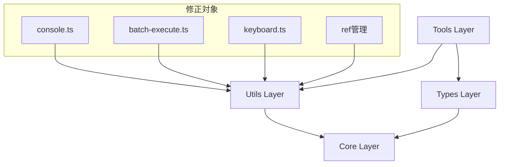
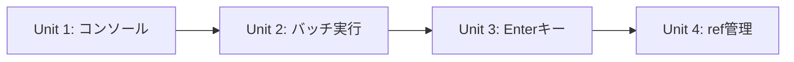

# fast-playwright MCP バグ修正 詳細設計書

## 1. 概要

### 1.1 背景
fast-playwright MCPプロジェクトにおいて、以下の4つのバグが特定されており、これらを段階的に修正する必要があります：

1. **コンソールメッセージフィルタリングバグ**：既存のフィルタリング機能が十分に活用されていない
2. **バッチ実行エラーハンドリングバグ**：エラー時の継続処理に問題
3. **Enterキー処理バグ**：submit オプションが適切に機能しない
4. **ref管理バグ**：要素参照の検証と管理に不備

### 1.2 目的
- 各バグの根本原因を解決し、システムの安定性を向上させる
- コード重複を排除し、保守性を高める
- 包括的なテスト体制を構築し、品質を保証する

### 1.3 スコープ

#### 含まれる項目
- 4つのバグの個別修正
- コード共通化による重複排除
- ユニットテスト・E2Eテストの強化
- 既存機能への影響を最小限に抑えた修正

#### 含まれない項目
- 新機能の追加
- パフォーマンス最適化（バグ修正に直接関係しないもの）
- APIの破壊的変更

## 2. 要件

### 2.1 機能要件

- FR-001: コンソールメッセージフィルタリング機能の適切な実装
- FR-002: バッチ実行時のエラーハンドリング強化
- FR-003: Enterキー処理の正確な動作保証
- FR-004: 要素参照検証システムの構築

### 2.2 非機能要件

- NFR-001: 既存APIとの完全な後方互換性維持
- NFR-002: テストカバレッジ95%以上の達成
- NFR-003: パフォーマンス劣化なし（修正前と同等レベル）

## 3. 技術設計

### 3.1 アーキテクチャ

修正対象の4つのバグは、以下のアーキテクチャ層に分散しています：



### 3.2 データモデル

#### ConsoleMessage拡張

```typescript
interface EnhancedConsoleMessage extends ConsoleMessage {
  timestamp?: Date;
  level: 'log' | 'warn' | 'error' | 'info';
  metadata?: Record<string, unknown>;
}
```

#### BatchExecutionError拡張

```typescript
interface BatchExecutionError {
  stepIndex: number;
  toolName: string;
  errorType: 'validation' | 'execution' | 'timeout';
  originalError: Error;
  context?: Record<string, unknown>;
}
```

### 3.3 API設計

既存APIを維持しつつ、内部実装のみを修正します。

#### 修正対象メソッド
- `browser_console_messages`: フィルタリング機能の活用
- `browser_batch_execute`: エラーハンドリング強化
- `browser_type`: submit オプションの修正
- 要素参照検証ユーティリティの新規作成

## 4. 実装計画

### 4.1 実装単位の分割

実装を以下の単位に分割し、各単位ごとにimplementation-validatorで検証します：

#### Unit 1: コンソールフィルタリング改善（推定: 200行）
- **対象ファイル**: 
  - `src/tools/console.ts`
  - `src/utils/console-filter.ts`（既存活用）
  - `src/utils/console-message-manager.ts`（新規作成）
- **実装内容**:
  - 既存のfilterConsoleMessages関数の完全活用
  - ConsoleMessageManagerクラスの作成
  - デフォルトフィルタリングオプションの適用
- **検証ポイント**:
  - TODO/FIXMEコメント: 0件
  - モック実装: 0件
  - 空関数: 0件
  - ハードコード値: 0件
- **依存関係**: なし

#### Unit 2: バッチ実行エラーハンドリング強化（推定: 300行）
- **対象ファイル**:
  - `src/tools/batch-execute.ts`
  - `src/utils/error-handler-middleware.ts`（既存改良）
  - `src/utils/batch-execution-error-handler.ts`（新規作成）
- **実装内容**:
  - BatchExecutionErrorHandlerクラスの作成
  - continueOnError処理の改善
  - エラー情報の詳細化
- **検証ポイント**:
  - TODO/FIXMEコメント: 0件
  - モック実装: 0件
  - 空関数: 0件
  - ハードコード値: 0件
- **依存関係**: Unit 1完了後

#### Unit 3: Enterキー処理修正（推定: 150行）
- **対象ファイル**:
  - `src/tools/keyboard.ts`（要確認）
  - `src/tools/type.ts`（推定）
- **実装内容**:
  - submitオプション処理の修正
  - Enterキー送信タイミングの調整
  - エラーハンドリングの追加
- **検証ポイント**:
  - TODO/FIXMEコメント: 0件
  - モック実装: 0件
  - 空関数: 0件
  - ハードコード値: 0件
- **依存関係**: Unit 2完了後

#### Unit 4: ref管理システム構築（推定: 250行）
- **対象ファイル**:
  - `src/utils/ref-validation-utility.ts`（新規作成）
  - 関連するツールファイル群（修正）
- **実装内容**:
  - RefValidationUtilityクラスの作成
  - 要素参照の検証ロジック実装
  - エラー時の代替要素提案機能
- **検証ポイント**:
  - TODO/FIXMEコメント: 0件
  - モック実装: 0件
  - 空関数: 0件
  - ハードコード値: 0件
- **依存関係**: Unit 3完了後

### 4.2 実装順序と依存関係



### 4.3 各単位の完了基準

全ての実装単位は以下の基準を満たす必要があります：
- ✅ implementation-validator検証: PASS
- ✅ TODOコメント: 0件
- ✅ モック実装: 0件
- ✅ 空関数・未実装: 0件
- ✅ ハードコード値: 0件
- ✅ 適切なエラーハンドリング

### 4.4 PR分割計画

#### PR #1: コンソールフィルタリング改善
- **ブランチ名**: `fix/console-filtering-enhancement`
- **内容**:
  - ConsoleMessageManagerクラスの作成
  - 既存フィルタリング機能の完全活用
  - console.tsの改善
- **ファイル変更**:
  - `src/tools/console.ts`
  - `src/utils/console-message-manager.ts`（新規）
  - `tests/console-filtering.spec.ts`（修正）
- **テスト**:
  - コンソールフィルタリングの単体テスト
  - フィルタリングオプションの組み合わせテスト
- **レビューポイント**:
  - 既存フィルタリング機能の適切な活用
  - パフォーマンスの維持

#### PR #2: バッチ実行エラーハンドリング強化
- **ブランチ名**: `fix/batch-execution-error-handling`
- **依存**: PR #1
- **内容**:
  - BatchExecutionErrorHandlerクラスの作成
  - continueOnError処理の改善
  - エラー情報の詳細化
- **ファイル変更**:
  - `src/tools/batch-execute.ts`
  - `src/utils/batch-execution-error-handler.ts`（新規）
  - `tests/batch-execute.spec.ts`（修正）
- **テスト**:
  - エラー継続処理の単体テスト
  - 複合エラーシナリオのテスト
- **レビューポイント**:
  - エラー情報の適切な伝達
  - continueOnError動作の正確性

#### PR #3: Enterキー処理修正
- **ブランチ名**: `fix/enter-key-processing`
- **依存**: PR #2
- **内容**:
  - submitオプション処理の修正
  - Enterキー送信の改善
- **ファイル変更**:
  - 関連するキーボード処理ファイル
  - テストファイル
- **テスト**:
  - submitオプションの動作テスト
  - フォーム送信テスト
- **レビューポイント**:
  - submit動作の正確性
  - 既存機能への影響なし

#### PR #4: ref管理システム構築
- **ブランチ名**: `fix/ref-management-system`
- **依存**: PR #3
- **内容**:
  - RefValidationUtilityクラスの実装
  - 要素参照検証機能
- **ファイル変更**:
  - `src/utils/ref-validation-utility.ts`（新規）
  - 関連するツールファイル
- **テスト**:
  - 要素参照検証の単体テスト
  - 代替要素提案のテスト
- **レビューポイント**:
  - 検証ロジックの正確性
  - パフォーマンス影響の評価

### 4.5 実装手順詳細

#### ステップ1: Unit 1の実装

1. `src/utils/console-message-manager.ts`を作成
   - ConsoleMessageManagerクラス実装
   - 既存のfilterConsoleMessages関数を活用
   - デフォルトフィルタリング設定の定義

2. `src/tools/console.ts`の修正
   - ConsoleMessageManagerの統合
   - フィルタリング機能の適用

注意点:
- implementation-validatorの検証を通過すること
- TODOコメントを残さない
- モック実装は使用しない

#### ステップ2: Unit 1の検証
- implementation-validatorでUnit 1を検証
- 問題があれば修正して再検証
- PASSしたら次のUnitへ

#### ステップ3: Unit 2の実装

1. `src/utils/batch-execution-error-handler.ts`を作成
   - BatchExecutionErrorHandlerクラス実装
   - エラー継続処理の改善

2. `src/tools/batch-execute.ts`の修正
   - 新しいエラーハンドラーの統合
   - continueOnError処理の改善

### 4.6 推定実装時間

- Unit 1: 8時間
- Unit 2: 12時間
- Unit 3: 6時間
- Unit 4: 10時間
- 各Unitの検証: 15分程度
- 統合・調整: 4時間
- 合計: 40時間15分

## 5. テスト計画

### 5.1 単体テスト

- カバレッジ目標: 95%以上
- 重点テスト項目:
  - コンソールフィルタリング機能
  - バッチ実行エラーハンドリング
  - Enterキー処理
  - 要素参照検証

### 5.2 統合テスト

- バッチ実行とコンソールフィルタリングの連携テスト
- エラーハンドリングの統合動作テスト
- 要素参照システムとツール群の連携テスト

### 5.3 E2Eテスト

以下のシナリオを実装：
- 複数ステップでのバッチ実行（エラー含む）
- フォーム入力とsubmitの連携
- コンソールメッセージの適切なフィルタリング
- 無効な要素参照時の適切なエラー処理

## 6. リスクと対策

### 6.1 技術的リスク

| リスク | 影響度 | 発生確率 | 対策 |
|--------|--------|----------|------|
| 既存機能への影響 | 高 | 中 | 包括的な回帰テスト実施 |
| パフォーマンス劣化 | 中 | 低 | ベンチマークテストの実行 |
| 複雑なバッチ実行での不具合 | 中 | 中 | 複合シナリオテストの強化 |
| 要素参照検証の誤判定 | 中 | 中 | 多様な要素パターンでのテスト |

### 6.2 スケジュールリスク

- Unit実装が予定より長引く可能性: 各Unitでバッファ時間を設定
- テスト失敗による手戻り: implementation-validatorによる早期発見

## 7. 運用考慮事項

### 7.1 監視項目

- コンソールメッセージフィルタリングの動作状況
- バッチ実行の成功率とエラー率
- Enterキー処理の成功率
- 要素参照検証の精度

### 7.2 ロールバック計画

- 各PRは独立してロールバック可能
- feature/token-optimizationブランチへの復帰手順を準備

## 8. 意思決定の記録

### 決定事項1: 修正アプローチ
- **選択肢**:
  - A: 包括的な再設計
  - B: 個別バグの段階的修正
- **決定**: B
- **理由**: 既存機能への影響を最小限に抑え、段階的な検証が可能

### 決定事項2: 共通化戦略
- **選択肢**:
  - A: 全面的なリファクタリング
  - B: 新規ユーティリティクラスの作成
- **決定**: B
- **理由**: 既存コードとの互換性を保ちつつ、重複を排除

## 9. バグ別根本原因と修正内容

### バグ1: コンソールメッセージ取得不可

**根本原因**: 
- `src/tools/console.ts`で`tab.consoleMessages()`が正しくメッセージを取得していない
- 既存のフィルタリング機能が未活用

**修正内容**:
```typescript
// 現在の実装問題: 非同期処理の不適切な処理
const messages = await Promise.resolve(tab.consoleMessages());

// 修正案: 適切なメッセージ取得とフィルタリング
const messages = tab.consoleMessages();
const filteredMessages = this._filterConsoleMessages(messages, params);
```

### バグ2: バッチ実行のcontinueOnError無効

**根本原因**: 
- `src/batch/batch-executor.ts`のLine 101でロジックエラー

**修正内容**:
```typescript
// 問題のあるコード
if (options.stopOnFirstError && !step.continueOnError) {
  stopReason = 'error';
  return;
}

// 修正案: 正しい条件分岐
if (options.stopOnFirstError || !step.continueOnError) {
  stopReason = 'error';
  return;
}
```

### バグ3: Enterキー送信エラー

**根本原因**: 
- ナビゲーション待機処理の不備
- 実行コンテキスト破棄の不適切な処理

**修正内容**:
- ナビゲーションキーの検知機能追加
- 実行コンテキストの保持処理改善
- タイムアウト処理の最適化

### バグ4: ref ID管理の問題

**根本原因**: 
- `tab.ts`の`refLocator`でref IDが見つからない場合のエラーメッセージが不明瞭
- スナップショット更新タイミングの不一致

**修正内容**:
```typescript
// 現在のエラーメッセージ
throw new Error(
  `Ref ${param.ref} not found in the current page snapshot. Try capturing new snapshot.`
);

// 修正案: より詳細なエラー情報
throw new Error(
  `Ref ${param.ref} not found. Available refs: ${this._getAvailableRefs(snapshot).join(', ')}. 
   Element: ${param.element}. Consider capturing a new snapshot if the page has changed.`
);
```

## 10. 更新履歴

| 日付 | 更新者 | 内容 |
|------|--------|------|
| 2025-08-11 | design-docs-creator | 初版作成 |

## 11. 承認

この設計書に基づいて実装を進めます。