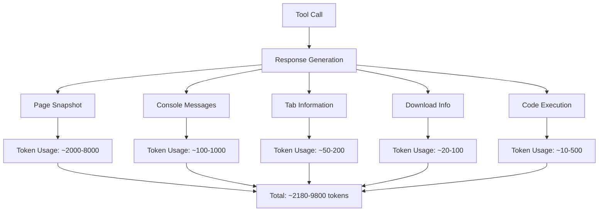
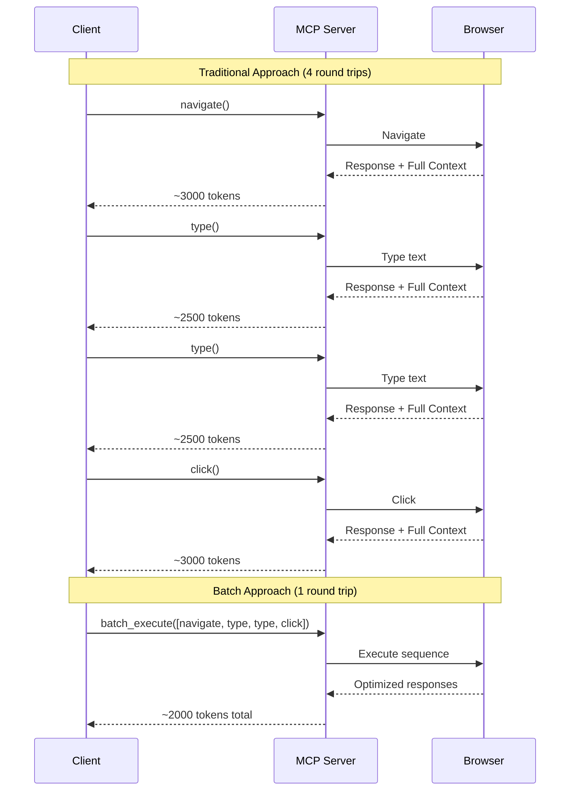

# Performance Optimization Guide

This comprehensive guide covers performance optimization strategies for the Playwright MCP server, focusing on token reduction and execution speed improvements through the expectation parameter and batch execution features.

## Table of Contents

1. [Overview](#overview)
2. [Token Optimization Fundamentals](#token-optimization-fundamentals)
3. [Batch Execution Performance](#batch-execution-performance)
4. [Measurement and Benchmarking](#measurement-and-benchmarking)
5. [Tool-Specific Optimization](#tool-specific-optimization)
6. [Advanced Optimization Techniques](#advanced-optimization-techniques)
7. [Performance Monitoring](#performance-monitoring)
8. [Troubleshooting Performance Issues](#troubleshooting-performance-issues)

## Overview

### Performance Goals

The Playwright MCP server's optimization features target these key metrics:

- **Token Reduction**: 50-80% reduction in response token usage
- **Execution Speed**: 2-5x improvement in multi-step workflows
- **Latency Reduction**: 60-80% reduction in round-trip communication
- **Cost Optimization**: Proportional reduction in API costs

### Core Technologies

- **Response Filtering**: Selective inclusion of response components via expectation parameters
- **Batch Execution**: Multiple operations in single requests with optimized handling
- **Tool-Specific Defaults**: Intelligent default configurations based on tool characteristics
- **Selective Snapshots**: CSS selector-based partial page capture

## Token Optimization Fundamentals

### Understanding Token Usage



### Response Component Analysis

| Component | Typical Size | Token Estimate | Optimization Potential |
|-----------|-------------|----------------|----------------------|
| Page Snapshot | 5KB-30KB | 1250-7500 | High (CSS selectors, format) |
| Console Messages | 200B-4KB | 50-1000 | Medium (filtering, limits) |
| Tab Information | 100B-800B | 25-200 | High (often unnecessary) |
| Download Info | 50B-400B | 12-100 | High (rarely needed) |
| Code Execution | 50B-2KB | 12-500 | Low (usually necessary) |

### Expectation Parameter Impact

```javascript
// Baseline - Standard call
await browser_navigate({ url: 'https://example.com' });
// Estimated tokens: 3000-8000

// Level 1 - Basic optimization (70% reduction)
await browser_navigate({ 
  url: 'https://example.com',
  expectation: { includeSnapshot: false, includeConsole: false }
});
// Estimated tokens: 900-2400

// Level 2 - Selective snapshot (85% reduction)
await browser_navigate({ 
  url: 'https://example.com',
  expectation: { 
    includeSnapshot: true,
    snapshotOptions: { selector: '.main-content', maxLength: 1000 },
    includeConsole: false,
    includeTabs: false
  }
});
// Estimated tokens: 450-1200

// Level 3 - Maximum optimization (95% reduction)
await browser_navigate({ 
  url: 'https://example.com',
  expectation: { 
    includeSnapshot: false,
    includeConsole: false,
    includeTabs: false,
    includeDownloads: false,
    includeCode: false
  }
});
// Estimated tokens: 150-400
```

## Batch Execution Performance

### Latency Reduction Analysis



### Performance Comparison

| Metric | Traditional | Batch Execution | Improvement |
|--------|------------|----------------|-------------|
| **Round Trips** | 4 | 1 | 75% reduction |
| **Total Latency** | 800ms-2000ms | 200ms-500ms | 60-75% reduction |
| **Token Usage** | 11,000 tokens | 2,000 tokens | 82% reduction |
| **Network Overhead** | 4x protocol overhead | 1x protocol overhead | 75% reduction |
| **Error Recovery** | Manual handling | Built-in strategies | N/A |

### Batch Size Optimization

```javascript
// Performance vs batch size analysis
const performanceData = {
  batchSize1: { latency: 200, tokens: 3000, overhead: 'high' },
  batchSize3: { latency: 250, tokens: 2200, overhead: 'optimal' },
  batchSize5: { latency: 300, tokens: 1800, overhead: 'optimal' },
  batchSize7: { latency: 400, tokens: 1500, overhead: 'good' },
  batchSize10: { latency: 600, tokens: 1200, overhead: 'diminishing' },
  batchSize15: { latency: 900, tokens: 1000, overhead: 'poor' }
};

// Optimal batch size: 3-7 steps
```

## Measurement and Benchmarking

### Token Counting Utilities

```javascript
/**
 * Utility functions for performance measurement
 */

// Rough token estimation (1 token ≈ 4 characters)
function estimateTokens(response) {
  if (typeof response === 'string') {
    return Math.ceil(response.length / 4);
  }
  if (response && response.content && response.content[0] && response.content[0].text) {
    return Math.ceil(response.content[0].text.length / 4);
  }
  return 0;
}

// More accurate token counting for evaluation
function countTokensAccurately(text) {
  // Simple word-based estimation (more accurate than character count)
  const words = text.split(/\s+/).length;
  const characters = text.length;
  
  // GPT-style estimation: ~0.75 tokens per word, min 1 token per 4 chars
  return Math.max(
    Math.ceil(words * 0.75),
    Math.ceil(characters / 4)
  );
}

// Performance benchmark helper
class PerformanceBenchmark {
  constructor(name) {
    this.name = name;
    this.startTime = null;
    this.tokensBefore = 0;
    this.tokensAfter = 0;
  }
  
  start() {
    this.startTime = Date.now();
    return this;
  }
  
  recordTokens(response, phase = 'after') {
    const tokens = estimateTokens(response);
    if (phase === 'before') {
      this.tokensBefore += tokens;
    } else {
      this.tokensAfter += tokens;
    }
    return this;
  }
  
  finish() {
    const duration = Date.now() - this.startTime;
    const tokenReduction = this.tokensBefore > 0 
      ? ((this.tokensBefore - this.tokensAfter) / this.tokensBefore * 100)
      : 0;
    
    console.log(`\n📊 ${this.name} Performance Results:`);
    console.log(`⏱️  Execution Time: ${duration}ms`);
    console.log(`🎯 Token Usage: ${this.tokensAfter} (${tokenReduction.toFixed(1)}% reduction)`);
    console.log(`💰 Est. Cost Savings: ${(tokenReduction * 0.01).toFixed(2)}¢ per 1K tokens`);
    
    return {
      duration,
      tokensUsed: this.tokensAfter,
      tokenReduction: tokenReduction,
      costSavings: tokenReduction * 0.01
    };
  }
}

// Usage example
const benchmark = new PerformanceBenchmark('Login Workflow');
benchmark.start();

// Baseline measurement
const baselineResponse = await browser_navigate({ url: 'https://example.com' });
benchmark.recordTokens(baselineResponse, 'before');

// Optimized measurement
const optimizedResponse = await browser_navigate({
  url: 'https://example.com',
  expectation: { includeSnapshot: false, includeConsole: false }
});
benchmark.recordTokens(optimizedResponse, 'after');

const results = benchmark.finish();
```

### A/B Testing Framework

```javascript
/**
 * Compare traditional vs optimized approaches
 */
async function performanceComparison(testCase) {
  const results = {
    traditional: { duration: 0, tokens: 0, steps: [] },
    optimized: { duration: 0, tokens: 0, steps: [] }
  };
  
  // Traditional approach
  console.log('🔄 Running traditional approach...');
  const traditionalStart = Date.now();
  
  for (const step of testCase.steps) {
    const stepStart = Date.now();
    const response = await step.execute();
    const stepDuration = Date.now() - stepStart;
    const tokens = estimateTokens(response);
    
    results.traditional.steps.push({
      name: step.name,
      duration: stepDuration,
      tokens: tokens
    });
    results.traditional.tokens += tokens;
  }
  
  results.traditional.duration = Date.now() - traditionalStart;
  
  // Optimized approach
  console.log('⚡ Running optimized approach...');
  const optimizedStart = Date.now();
  
  const batchResponse = await browser_batch_execute({
    steps: testCase.batchSteps,
    globalExpectation: testCase.globalExpectation
  });
  
  results.optimized.duration = Date.now() - optimizedStart;
  results.optimized.tokens = estimateTokens(batchResponse);
  
  // Analysis
  const speedImprovement = results.traditional.duration / results.optimized.duration;
  const tokenReduction = (results.traditional.tokens - results.optimized.tokens) / results.traditional.tokens * 100;
  
  console.log('\n📈 Performance Comparison Results:');
  console.log(`🚀 Speed Improvement: ${speedImprovement.toFixed(1)}x faster`);
  console.log(`🎯 Token Reduction: ${tokenReduction.toFixed(1)}%`);
  console.log(`⏱️  Traditional: ${results.traditional.duration}ms, ${results.traditional.tokens} tokens`);
  console.log(`⚡ Optimized: ${results.optimized.duration}ms, ${results.optimized.tokens} tokens`);
  
  return results;
}
```

## Tool-Specific Optimization

### Navigation Tools

```javascript
// browser_navigate optimization strategies
const navigationOptimization = {
  // High-traffic pages - minimal context
  lightNavigation: {
    includeSnapshot: false,
    includeConsole: false,
    includeTabs: false,
    includeDownloads: false
  },
  
  // Verification needed - selective snapshot
  verificationNavigation: {
    includeSnapshot: true,
    snapshotOptions: {
      selector: '.main-content, .error-message',
      maxLength: 1500,
      format: 'text'
    },
    includeConsole: true,
    consoleOptions: {
      levels: ['error'],
      maxMessages: 3
    }
  },
  
  // Debug mode - full context
  debugNavigation: {
    includeSnapshot: true,
    includeConsole: true,
    consoleOptions: {
      levels: ['log', 'warn', 'error'],
      maxMessages: 15
    },
    includeTabs: true
  }
};
```

### Interactive Tools

```javascript
// browser_click, browser_type optimization
const interactionOptimization = {
  // Form filling - no feedback needed
  silentInteraction: {
    includeSnapshot: false,
    includeConsole: false
  },
  
  // Critical interactions - feedback required
  verifiedInteraction: {
    includeSnapshot: true,
    snapshotOptions: {
      selector: '.feedback, .validation, .result',
      maxLength: 800
    },
    includeConsole: true,
    consoleOptions: {
      levels: ['error', 'warn'],
      maxMessages: 5
    }
  },
  
  // State change monitoring
  stateChangeInteraction: {
    includeSnapshot: true,
    snapshotOptions: {
      selector: '.dynamic-content, .status-indicator',
      format: 'aria'
    }
  }
};
```

### Data Extraction Tools

```javascript
// browser_snapshot, browser_evaluate optimization
const extractionOptimization = {
  // Targeted data extraction
  focusedExtraction: {
    includeSnapshot: true,
    snapshotOptions: {
      selector: '.data-table, .metrics, .results',
      format: 'text',
      maxLength: 3000
    },
    includeConsole: false
  },
  
  // Full page analysis
  comprehensiveExtraction: {
    includeSnapshot: true,
    snapshotOptions: {
      format: 'html',
      maxLength: 10000
    },
    includeConsole: true,
    consoleOptions: {
      levels: ['error'],
      maxMessages: 5
    }
  }
};
```

## Advanced Optimization Techniques

### Dynamic Expectation Adjustment

```javascript
/**
 * Dynamically adjust expectations based on context
 */
class AdaptiveOptimizer {
  constructor() {
    this.pageComplexity = 'medium';
    this.debugMode = false;
    this.performanceMode = 'balanced';
  }
  
  getExpectation(toolName, context = {}) {
    const base = this.getBaseExpectation(toolName);
    
    // Adjust based on page complexity
    if (this.pageComplexity === 'high') {
      base.snapshotOptions = {
        ...base.snapshotOptions,
        selector: base.snapshotOptions?.selector || '.main-content',
        maxLength: Math.min(base.snapshotOptions?.maxLength || 2000, 1500)
      };
    }
    
    // Debug mode overrides
    if (this.debugMode) {
      return {
        includeSnapshot: true,
        includeConsole: true,
        consoleOptions: { levels: ['log', 'warn', 'error'], maxMessages: 20 }
      };
    }
    
    // Performance mode adjustments
    if (this.performanceMode === 'maximum') {
      return {
        includeSnapshot: context.requiresVerification || false,
        includeConsole: false,
        includeTabs: false,
        includeDownloads: false
      };
    }
    
    return base;
  }
  
  analyzePageComplexity(snapshot) {
    const length = snapshot?.length || 0;
    if (length > 10000) this.pageComplexity = 'high';
    else if (length > 5000) this.pageComplexity = 'medium';
    else this.pageComplexity = 'low';
  }
}

// Usage
const optimizer = new AdaptiveOptimizer();

// Analyze initial page
const initialSnapshot = await browser_snapshot();
optimizer.analyzePageComplexity(initialSnapshot);

// Use adaptive expectations
await browser_click({
  element: 'submit button',
  ref: '#submit',
  expectation: optimizer.getExpectation('browser_click', { 
    requiresVerification: true 
  })
});
```

### Conditional Batching

```javascript
/**
 * Intelligently decide when to use batch execution
 */
class BatchOptimizer {
  constructor() {
    this.pendingOperations = [];
    this.batchThreshold = 3;
    this.maxBatchSize = 7;
  }
  
  addOperation(tool, args, options = {}) {
    this.pendingOperations.push({
      tool,
      arguments: args,
      expectation: options.expectation,
      continueOnError: options.continueOnError || false,
      priority: options.priority || 'normal'
    });
    
    // Auto-execute when threshold reached
    if (this.pendingOperations.length >= this.batchThreshold) {
      return this.executeBatch();
    }
    
    return Promise.resolve();
  }
  
  async executeBatch() {
    if (this.pendingOperations.length === 0) return;
    
    if (this.pendingOperations.length === 1) {
      // Single operation - execute directly
      const op = this.pendingOperations[0];
      this.pendingOperations = [];
      return await this.executeSingle(op);
    }
    
    // Multiple operations - use batch
    const batch = this.pendingOperations.splice(0, this.maxBatchSize);
    
    return await browser_batch_execute({
      steps: batch,
      globalExpectation: this.getOptimalGlobalExpectation(batch),
      stopOnFirstError: this.shouldStopOnError(batch)
    });
  }
  
  getOptimalGlobalExpectation(batch) {
    // Analyze batch to determine optimal global settings
    const hasVerificationSteps = batch.some(op => 
      op.tool.includes('click') || op.tool.includes('submit')
    );
    
    const hasNavigationSteps = batch.some(op => 
      op.tool.includes('navigate')
    );
    
    return {
      includeSnapshot: hasVerificationSteps,
      includeConsole: hasNavigationSteps,
      includeTabs: false,
      includeDownloads: false
    };
  }
  
  shouldStopOnError(batch) {
    return batch.some(op => op.priority === 'critical');
  }
  
  async executeSingle(operation) {
    const toolFunction = this.getToolFunction(operation.tool);
    return await toolFunction({
      ...operation.arguments,
      expectation: operation.expectation
    });
  }
  
  getToolFunction(toolName) {
    // Map tool names to actual functions
    const toolMap = {
      'browser_navigate': browser_navigate,
      'browser_click': browser_click,
      'browser_type': browser_type,
      // ... other tools
    };
    return toolMap[toolName];
  }
}

// Usage
const batchOptimizer = new BatchOptimizer();

// Queue operations - automatically batched when threshold reached
await batchOptimizer.addOperation('browser_navigate', { url: 'https://example.com' });
await batchOptimizer.addOperation('browser_type', { element: 'search', ref: '#search', text: 'query' });
await batchOptimizer.addOperation('browser_click', { element: 'button', ref: '#submit' }, {
  expectation: { includeSnapshot: true },
  priority: 'critical'
});

// Execute any remaining operations
await batchOptimizer.executeBatch();
```

### Performance-Aware Snapshot Strategies

```javascript
/**
 * Intelligent snapshot sizing based on content analysis
 */
class SnapshotOptimizer {
  constructor() {
    this.pageSizeHistory = [];
    this.selectorEffectiveness = new Map();
  }
  
  analyzeAndOptimize(pageSnapshot, targetSelectors = []) {
    const pageSize = pageSnapshot.length;
    this.pageSizeHistory.push(pageSize);
    
    // Dynamic size limits based on page characteristics
    const averagePageSize = this.getAveragePageSize();
    const maxLength = this.calculateOptimalMaxLength(averagePageSize);
    
    // Test selector effectiveness
    const optimalSelector = this.findOptimalSelector(pageSnapshot, targetSelectors);
    
    return {
      selector: optimalSelector,
      maxLength: maxLength,
      format: this.getOptimalFormat(pageSnapshot, optimalSelector)
    };
  }
  
  calculateOptimalMaxLength(averagePageSize) {
    if (averagePageSize > 20000) return 1000;  // Large pages - aggressive limit
    if (averagePageSize > 10000) return 1500;  // Medium pages - moderate limit
    if (averagePageSize > 5000) return 2000;   // Small pages - generous limit
    return 3000; // Very small pages - no strict limit
  }
  
  findOptimalSelector(pageSnapshot, candidates) {
    let bestSelector = null;
    let bestReduction = 0;
    
    for (const selector of candidates) {
      // Simulate selector application (simplified)
      const estimatedReduction = this.estimateSelectorReduction(pageSnapshot, selector);
      
      if (estimatedReduction > bestReduction) {
        bestReduction = estimatedReduction;
        bestSelector = selector;
      }
    }
    
    return bestSelector || '.main-content, .content, main';
  }
  
  estimateSelectorReduction(pageSnapshot, selector) {
    // Simplified estimation based on common patterns
    const selectorSpecificity = selector.split(',').length;
    const hasIdSelector = selector.includes('#');
    const hasClassSelector = selector.includes('.');
    
    let estimatedReduction = 0.3; // Base 30% reduction
    
    if (hasIdSelector) estimatedReduction += 0.2;
    if (hasClassSelector) estimatedReduction += 0.1;
    if (selectorSpecificity > 1) estimatedReduction += 0.1;
    
    return Math.min(estimatedReduction, 0.8); // Cap at 80% reduction
  }
  
  getOptimalFormat(pageSnapshot, selector) {
    // Choose format based on content characteristics
    const hasComplexStructure = pageSnapshot.includes('aria-') || pageSnapshot.includes('role=');
    const isDataHeavy = pageSnapshot.includes('table') || pageSnapshot.includes('grid');
    
    if (isDataHeavy && selector) return 'text'; // Text format for data extraction
    if (hasComplexStructure) return 'aria';     // Aria for accessibility info
    return 'html'; // HTML for general purpose
  }
  
  getAveragePageSize() {
    if (this.pageSizeHistory.length === 0) return 5000;
    
    const sum = this.pageSizeHistory.reduce((a, b) => a + b, 0);
    return sum / this.pageSizeHistory.length;
  }
}

// Usage
const snapshotOptimizer = new SnapshotOptimizer();

// Get optimized snapshot options
const initialSnapshot = await browser_snapshot();
const optimizedOptions = snapshotOptimizer.analyzeAndOptimize(
  initialSnapshot.content[0].text,
  ['.dashboard', '.main-content', '.results', '#content']
);

// Use optimized settings
await browser_click({
  element: 'submit button',
  ref: '#submit',
  expectation: {
    includeSnapshot: true,
    snapshotOptions: optimizedOptions
  }
});
```

## Performance Monitoring

### Real-time Performance Tracking

```javascript
/**
 * Monitor performance metrics in production
 */
class PerformanceMonitor {
  constructor() {
    this.metrics = {
      totalCalls: 0,
      totalTokens: 0,
      totalTime: 0,
      toolMetrics: new Map(),
      optimizationImpact: {
        tokensSaved: 0,
        timeSaved: 0
      }
    };
  }
  
  trackCall(toolName, duration, tokens, optimized = false) {
    this.metrics.totalCalls++;
    this.metrics.totalTokens += tokens;
    this.metrics.totalTime += duration;
    
    // Tool-specific tracking
    if (!this.metrics.toolMetrics.has(toolName)) {
      this.metrics.toolMetrics.set(toolName, {
        calls: 0,
        tokens: 0,
        time: 0,
        optimizedCalls: 0
      });
    }
    
    const toolMetric = this.metrics.toolMetrics.get(toolName);
    toolMetric.calls++;
    toolMetric.tokens += tokens;
    toolMetric.time += duration;
    if (optimized) toolMetric.optimizedCalls++;
    
    // Estimate savings (compared to baseline)
    if (optimized) {
      const baselineTokens = this.estimateBaselineTokens(toolName);
      const baselineTime = this.estimateBaselineTime(toolName);
      
      this.metrics.optimizationImpact.tokensSaved += Math.max(0, baselineTokens - tokens);
      this.metrics.optimizationImpact.timeSaved += Math.max(0, baselineTime - duration);
    }
  }
  
  getPerformanceReport() {
    const avgTokensPerCall = this.metrics.totalTokens / this.metrics.totalCalls;
    const avgTimePerCall = this.metrics.totalTime / this.metrics.totalCalls;
    const optimizationRate = this.calculateOptimizationRate();
    
    return {
      summary: {
        totalCalls: this.metrics.totalCalls,
        avgTokensPerCall: Math.round(avgTokensPerCall),
        avgTimePerCall: Math.round(avgTimePerCall),
        optimizationRate: `${(optimizationRate * 100).toFixed(1)}%`
      },
      savings: {
        tokensSaved: this.metrics.optimizationImpact.tokensSaved,
        timeSaved: `${(this.metrics.optimizationImpact.timeSaved / 1000).toFixed(1)}s`,
        costSavings: `$${(this.metrics.optimizationImpact.tokensSaved * 0.00001).toFixed(4)}`
      },
      toolBreakdown: this.getToolBreakdown()
    };
  }
  
  calculateOptimizationRate() {
    let totalOptimized = 0;
    for (const [_, metric] of this.metrics.toolMetrics) {
      totalOptimized += metric.optimizedCalls;
    }
    return this.metrics.totalCalls > 0 ? totalOptimized / this.metrics.totalCalls : 0;
  }
  
  getToolBreakdown() {
    const breakdown = [];
    for (const [toolName, metric] of this.metrics.toolMetrics) {
      breakdown.push({
        tool: toolName,
        calls: metric.calls,
        avgTokens: Math.round(metric.tokens / metric.calls),
        avgTime: Math.round(metric.time / metric.calls),
        optimizationRate: `${((metric.optimizedCalls / metric.calls) * 100).toFixed(1)}%`
      });
    }
    return breakdown.sort((a, b) => b.calls - a.calls);
  }
  
  estimateBaselineTokens(toolName) {
    // Baseline estimates for unoptimized calls
    const baselines = {
      'browser_navigate': 4000,
      'browser_click': 3000,
      'browser_type': 2500,
      'browser_snapshot': 5000,
      'browser_evaluate': 1500
    };
    return baselines[toolName] || 3000;
  }
  
  estimateBaselineTime(toolName) {
    // Baseline time estimates (ms)
    const baselines = {
      'browser_navigate': 1500,
      'browser_click': 800,
      'browser_type': 600,
      'browser_snapshot': 400,
      'browser_evaluate': 1000
    };
    return baselines[toolName] || 1000;
  }
}

// Global monitor instance
const performanceMonitor = new PerformanceMonitor();

// Wrapper function to track performance
async function trackPerformance(toolName, toolFunction, args, optimized = false) {
  const startTime = Date.now();
  const result = await toolFunction(args);
  const duration = Date.now() - startTime;
  const tokens = estimateTokens(result);
  
  performanceMonitor.trackCall(toolName, duration, tokens, optimized);
  
  return result;
}

// Usage
const result = await trackPerformance(
  'browser_navigate',
  browser_navigate,
  { 
    url: 'https://example.com',
    expectation: { includeSnapshot: false }
  },
  true // optimized = true
);

// Get periodic reports
setInterval(() => {
  const report = performanceMonitor.getPerformanceReport();
  console.log('📊 Performance Report:', JSON.stringify(report, null, 2));
}, 60000); // Every minute
```

### Automated Optimization Recommendations

```javascript
/**
 * Analyze usage patterns and suggest optimizations
 */
class OptimizationAdvisor {
  constructor(performanceMonitor) {
    this.monitor = performanceMonitor;
    this.recommendations = [];
  }
  
  analyzeAndRecommend() {
    this.recommendations = [];
    
    const toolBreakdown = this.monitor.getToolBreakdown();
    
    for (const tool of toolBreakdown) {
      // High token usage tools
      if (tool.avgTokens > 3000) {
        this.recommendations.push({
          type: 'token-reduction',
          tool: tool.tool,
          priority: 'high',
          message: `${tool.tool} averaging ${tool.avgTokens} tokens. Consider adding expectation parameters.`,
          suggestion: {
            expectation: {
              includeSnapshot: tool.tool.includes('navigate') ? true : false,
              includeConsole: false,
              includeTabs: false
            }
          }
        });
      }
      
      // Low optimization rate
      if (parseFloat(tool.optimizationRate) < 50) {
        this.recommendations.push({
          type: 'optimization-rate',
          tool: tool.tool,
          priority: 'medium',
          message: `${tool.tool} only ${tool.optimizationRate} optimized. Consider batch execution for repeated calls.`,
          suggestion: {
            batchThreshold: 3,
            globalExpectation: { includeSnapshot: false }
          }
        });
      }
      
      // High latency tools
      if (tool.avgTime > 1000) {
        this.recommendations.push({
          type: 'latency-reduction',
          tool: tool.tool,
          priority: 'high',
          message: `${tool.tool} averaging ${tool.avgTime}ms. Consider selective snapshots or batch execution.`,
          suggestion: {
            snapshotOptions: {
              selector: '.main-content',
              maxLength: 1500
            }
          }
        });
      }
    }
    
    // Pattern-based recommendations
    this.addPatternRecommendations(toolBreakdown);
    
    return this.recommendations.sort((a, b) => {
      const priorityOrder = { 'high': 3, 'medium': 2, 'low': 1 };
      return priorityOrder[b.priority] - priorityOrder[a.priority];
    });
  }
  
  addPatternRecommendations(toolBreakdown) {
    // Detect sequential operation patterns
    const navigateCount = toolBreakdown.find(t => t.tool === 'browser_navigate')?.calls || 0;
    const typeCount = toolBreakdown.find(t => t.tool === 'browser_type')?.calls || 0;
    const clickCount = toolBreakdown.find(t => t.tool === 'browser_click')?.calls || 0;
    
    if (navigateCount + typeCount + clickCount > 10) {
      this.recommendations.push({
        type: 'batch-opportunity',
        tool: 'multiple',
        priority: 'high',
        message: `High volume of sequential operations detected (${navigateCount + typeCount + clickCount} total). Consider batch execution.`,
        suggestion: {
          implementBatching: true,
          batchSize: 5,
          globalExpectation: { includeSnapshot: false }
        }
      });
    }
    
    // Detect snapshot-heavy usage
    const snapshotCount = toolBreakdown.find(t => t.tool === 'browser_snapshot')?.calls || 0;
    const avgSnapshotTokens = toolBreakdown.find(t => t.tool === 'browser_snapshot')?.avgTokens || 0;
    
    if (snapshotCount > 5 && avgSnapshotTokens > 4000) {
      this.recommendations.push({
        type: 'snapshot-optimization',
        tool: 'browser_snapshot',
        priority: 'medium',
        message: `Snapshot calls are token-heavy (${avgSnapshotTokens} avg). Consider CSS selectors and format optimization.`,
        suggestion: {
          snapshotOptions: {
            selector: '.main-content, .data-section',
            format: 'text',
            maxLength: 2000
          }
        }
      });
    }
  }
  
  generateOptimizationPlan() {
    const recommendations = this.analyzeAndRecommend();
    
    const plan = {
      priority: 'Immediate',
      estimatedImpact: this.calculateEstimatedImpact(recommendations),
      actionItems: recommendations.map((rec, index) => ({
        id: index + 1,
        priority: rec.priority,
        action: rec.message,
        implementation: this.generateImplementationCode(rec)
      }))
    };
    
    return plan;
  }
  
  calculateEstimatedImpact(recommendations) {
    let tokenSavings = 0;
    let timeSavings = 0;
    
    for (const rec of recommendations) {
      if (rec.type === 'token-reduction') {
        tokenSavings += 2000; // Estimated per call
      }
      if (rec.type === 'latency-reduction') {
        timeSavings += 500; // Estimated per call (ms)
      }
      if (rec.type === 'batch-opportunity') {
        tokenSavings += 5000; // Estimated batch savings
        timeSavings += 2000;
      }
    }
    
    return {
      tokenReduction: `${tokenSavings} tokens per session`,
      timeReduction: `${(timeSavings / 1000).toFixed(1)}s per session`,
      costSavings: `$${(tokenSavings * 0.00001).toFixed(4)} per session`
    };
  }
  
  generateImplementationCode(recommendation) {
    switch (recommendation.type) {
      case 'token-reduction':
        return `
// Add expectation parameter to ${recommendation.tool}
await ${recommendation.tool}({
  // ... your existing arguments
  expectation: ${JSON.stringify(recommendation.suggestion.expectation, null, 2)}
});`;
      
      case 'batch-opportunity':
        return `
// Convert sequential calls to batch execution
await browser_batch_execute({
  steps: [
    { tool: 'browser_navigate', arguments: { url: 'your-url' } },
    { tool: 'browser_type', arguments: { /* your args */ } },
    { tool: 'browser_click', arguments: { /* your args */ } }
  ],
  globalExpectation: ${JSON.stringify(recommendation.suggestion.globalExpectation, null, 2)}
});`;
      
      case 'snapshot-optimization':
        return `
// Optimize snapshot capture
await browser_snapshot({
  expectation: {
    includeSnapshot: true,  
    snapshotOptions: ${JSON.stringify(recommendation.suggestion.snapshotOptions, null, 2)}
  }
});`;
      
      default:
        return '// Optimization implementation depends on specific use case';
    }
  }
}

// Usage
const advisor = new OptimizationAdvisor(performanceMonitor);
const optimizationPlan = advisor.generateOptimizationPlan();

console.log('🎯 Optimization Plan:', JSON.stringify(optimizationPlan, null, 2));
```

## Troubleshooting Performance Issues

### Common Performance Problems

#### 1. High Token Usage Despite Optimization

**Symptoms:**
- Expectation parameters set but token usage still high
- Selective snapshots not reducing response size
- Console filtering not working as expected

**Diagnosis:**
```javascript
// Debug token usage
async function debugTokenUsage(toolCall) {
  console.log('🔍 Debugging token usage...');
  
  const fullResponse = await toolCall({ includeEverything: true });
  const fullTokens = estimateTokens(fullResponse);
  
  const optimizedResponse = await toolCall({ 
    expectation: { 
      includeSnapshot: false, 
      includeConsole: false 
    } 
  });
  const optimizedTokens = estimateTokens(optimizedResponse);
  
  console.log(`Full response: ${fullTokens} tokens`);
  console.log(`Optimized response: ${optimizedTokens} tokens`);
  console.log(`Reduction: ${((fullTokens - optimizedTokens) / fullTokens * 100).toFixed(1)}%`);
  
  // Analyze response components
  const response = await toolCall({});
  console.log('Response structure:', Object.keys(response));
  
  if (response.content && response.content[0]) {
    const content = response.content[0].text;
    console.log('Content length:', content.length);
    console.log('Content preview:', content.substring(0, 200) + '...');
  }
}
```

**Solutions:**
- Verify expectation parameter syntax
- Check for tool-specific default overrides
- Use more specific CSS selectors
- Implement proper format conversion

#### 2. Batch Execution Not Improving Performance

**Symptoms:**
- Batch execution takes longer than individual calls
- Token usage not reduced with batch operations
- Frequent batch execution failures

**Diagnosis:**
```javascript
// Compare batch vs individual performance
async function compareBatchPerformance(steps) {
  console.log('⚖️ Comparing batch vs individual performance...');
  
  // Individual execution
  const individualStart = Date.now();
  const individualResponses = [];
  for (const step of steps) {
    const response = await executeIndividualStep(step);
    individualResponses.push(response);
  }
  const individualTime = Date.now() - individualStart;
  const individualTokens = individualResponses.reduce((sum, resp) => 
    sum + estimateTokens(resp), 0);
  
  // Batch execution
  const batchStart = Date.now();
  const batchResponse = await browser_batch_execute({ steps });
  const batchTime = Date.now() - batchStart;
  const batchTokens = estimateTokens(batchResponse);
  
  console.log('📊 Performance Comparison:');
  console.log(`Individual: ${individualTime}ms, ${individualTokens} tokens`);
  console.log(`Batch: ${batchTime}ms, ${batchTokens} tokens`);
  console.log(`Speed improvement: ${(individualTime / batchTime).toFixed(1)}x`);
  console.log(`Token reduction: ${((individualTokens - batchTokens) / individualTokens * 100).toFixed(1)}%`);
}
```

**Solutions:**
- Reduce batch size (optimal: 3-7 steps)
- Add appropriate error handling
- Use global expectations effectively
- Verify step dependencies

#### 3. Selective Snapshots Not Working

**Symptoms:**
- CSS selectors not reducing snapshot size
- Snapshot format changes not taking effect
- maxLength parameter ignored

**Diagnosis:**
```javascript
// Test snapshot selector effectiveness
async function testSnapshotSelectors(selectors) {
  console.log('🎯 Testing snapshot selectors...');
  
  // Full snapshot baseline
  const fullSnapshot = await browser_snapshot();
  const fullSize = fullSnapshot.content[0].text.length;
  console.log(`Full snapshot: ${fullSize} characters`);
  
  // Test each selector
  for (const selector of selectors) {
    const selectiveSnapshot = await browser_snapshot({
      expectation: {
        includeSnapshot: true,
        snapshotOptions: { selector, maxLength: 2000 }
      }
    });
    
    const selectiveSize = selectiveSnapshot.content[0].text.length;
    const reduction = ((fullSize - selectiveSize) / fullSize * 100).toFixed(1);
    
    console.log(`Selector "${selector}": ${selectiveSize} chars (${reduction}% reduction)`);
  }
}

// Usage
await testSnapshotSelectors([
  '.main-content',
  '#content',
  '.container .main',
  'main, .content, .primary'
]);
```

**Solutions:**
- Verify selector syntax and page structure
- Test selectors in browser developer tools
- Use multiple selectors for better coverage
- Implement format fallbacks

### Performance Monitoring Dashboard

```javascript
/**
 * Create a performance monitoring dashboard
 */
class PerformanceDashboard {
  constructor(monitor) {
    this.monitor = monitor;
    this.alertThresholds = {
      avgTokensPerCall: 3000,
      avgTimePerCall: 1000,
      optimizationRate: 0.5
    };
  }
  
  generateDashboard() {
    const report = this.monitor.getPerformanceReport();
    const alerts = this.checkAlerts(report);
    
    console.log('\n📊 PERFORMANCE DASHBOARD');
    console.log('========================');
    
    // Summary section
    console.log('\n📈 SUMMARY:');
    console.log(`Total API Calls: ${report.summary.totalCalls}`);
    console.log(`Avg Tokens/Call: ${report.summary.avgTokensPerCall}`);
    console.log(`Avg Time/Call: ${report.summary.avgTimePerCall}ms`);
    console.log(`Optimization Rate: ${report.summary.optimizationRate}`);
    
    // Savings section
    console.log('\n💰 SAVINGS:');
    console.log(`Tokens Saved: ${report.savings.tokensSaved.toLocaleString()}`);
    console.log(`Time Saved: ${report.savings.timeSaved}`);
    console.log(`Cost Savings: ${report.savings.costSavings}`);
    
    // Tool breakdown
    console.log('\n🔧 TOOL BREAKDOWN:');
    console.table(report.toolBreakdown);
    
    // Alerts
    if (alerts.length > 0) {
      console.log('\n🚨 PERFORMANCE ALERTS:');
      alerts.forEach(alert => {
        console.log(`${alert.severity === 'high' ? '🔴' : '🟡'} ${alert.message}`);
      });
    }
    
    // Recommendations
    const advisor = new OptimizationAdvisor(this.monitor);
    const recommendations = advisor.analyzeAndRecommend();
    
    if (recommendations.length > 0) {
      console.log('\n💡 OPTIMIZATION RECOMMENDATIONS:');
      recommendations.slice(0, 3).forEach((rec, index) => {
        console.log(`${index + 1}. [${rec.priority.toUpperCase()}] ${rec.message}`);
      });
    }
    
    return {
      report,
      alerts,
      recommendations: recommendations.slice(0, 5)
    };
  }
  
  checkAlerts(report) {
    const alerts = [];
    
    if (report.summary.avgTokensPerCall > this.alertThresholds.avgTokensPerCall) {
      alerts.push({
        severity: 'high',
        type: 'high-token-usage',
        message: `High token usage detected: ${report.summary.avgTokensPerCall} avg tokens/call`
      });
    }
    
    if (report.summary.avgTimePerCall > this.alertThresholds.avgTimePerCall) {
      alerts.push({
        severity: 'medium',
        type: 'high-latency',
        message: `High latency detected: ${report.summary.avgTimePerCall}ms avg time/call`
      });
    }
    
    const optimizationRate = parseFloat(report.summary.optimizationRate) / 100;
    if (optimizationRate < this.alertThresholds.optimizationRate) {
      alerts.push({
        severity: 'medium',
        type: 'low-optimization',
        message: `Low optimization rate: ${report.summary.optimizationRate} of calls optimized`
      });
    }
    
    return alerts;
  }
  
  startRealtimeMonitoring(intervalMs = 30000) {
    console.log(`🔄 Starting real-time monitoring (${intervalMs/1000}s intervals)...`);
    
    setInterval(() => {
      const dashboard = this.generateDashboard();
      
      // Only show alerts in real-time mode
      if (dashboard.alerts.length > 0) {
        console.log('\n🚨 REAL-TIME ALERTS:');
        dashboard.alerts.forEach(alert => {
          const emoji = alert.severity === 'high' ? '🔴' : '🟡';
          console.log(`${emoji} ${alert.message}`);
        });
      }
    }, intervalMs);
  }
}

// Usage
const dashboard = new PerformanceDashboard(performanceMonitor);

// Generate one-time dashboard
dashboard.generateDashboard();

// Start real-time monitoring
dashboard.startRealtimeMonitoring(60000); // Every minute
```

## Conclusion

This performance guide provides comprehensive strategies for optimizing the Playwright MCP server's token usage and execution speed. Key takeaways:

### 🎯 **Quick Wins (Immediate Implementation)**
1. Add `expectation: { includeSnapshot: false }` to intermediate steps
2. Use batch execution for 3+ sequential operations  
3. Filter console messages to errors only
4. Disable tabs and downloads info when not needed

### 📈 **Advanced Optimization (Long-term Strategy)**
1. Implement adaptive expectation adjustment
2. Use CSS selectors for selective snapshots
3. Set up performance monitoring and alerting
4. Create optimization recommendation systems

### 📊 **Expected Results**
- **Token Reduction**: 50-85% depending on optimization level
- **Speed Improvement**: 2-5x for multi-step workflows
- **Cost Reduction**: Proportional to token usage reduction
- **User Experience**: Faster response times and lower latency

Regular monitoring and iterative optimization will ensure continued performance improvements as your usage patterns evolve.