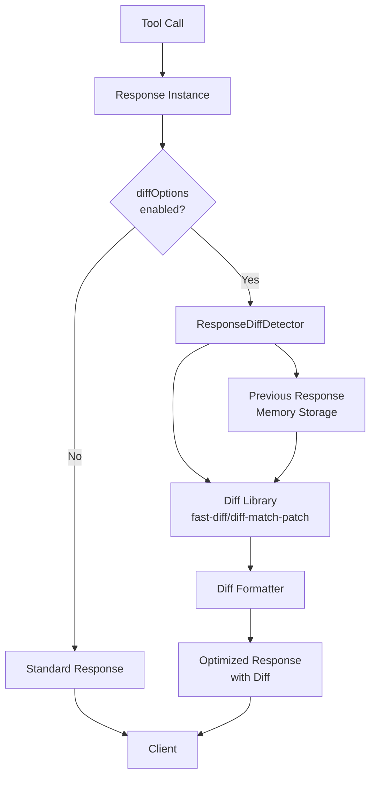

# レスポンス差分検出機能 Design Doc

## 1. 概要

### 1.1 背景
現在のfast-playwright-mcpでは、ブラウザ操作後のレスポンス内容を毎回フルで返しており、類似した操作や同じページでの複数操作において冗長な情報が多く含まれています。これにより、トークン使用量の増加とレスポンス処理時間の増加が発生しています。

### 1.2 目的
- **トークン使用量の削減**: 前回レスポンスとの差分のみを返すことで、大幅なトークン削減を実現
- **レスポンス効率化**: 変更部分のみに焦点を当てた、より効率的な情報提供
- **既存システムとの統合**: 現在のexpectationシステムを拡張する形での実装

### 1.3 スコープ

#### 含むもの
- expectationシステムへの差分検出オプション追加
- メモリベースの前回レスポンス保存機能
- 差分ライブラリ（diff-match-patch または fast-diff）の活用
- バッチ実行での差分検出対応
- 差分表示の最適化

#### 含まないもの
- 永続化による差分検出（セッション間での差分保持）
- 画像データの差分検出
- カスタム差分アルゴリズムの実装

## 2. 要件

### 2.1 機能要件

- **FR-001**: expectationパラメータに`diffOptions`を追加し、差分検出の有効/無効を制御
- **FR-002**: 前回のレスポンス内容をメモリ上に保存する機能
- **FR-003**: 差分ライブラリを使用したレスポンスの差分計算
- **FR-004**: 差分結果を分かりやすい形式で表示（追加/削除/変更）
- **FR-005**: バッチ実行における各ステップでの差分検出対応
- **FR-006**: 差分が小さい場合の最小変更閾値設定

### 2.2 非機能要件

- **NFR-001**: パフォーマンス要件 - 差分計算は100ms以内で完了
- **NFR-002**: メモリ使用量 - 前回レスポンス保存によるメモリ増加は10MB以内
- **NFR-003**: 既存機能への影響なし - expectationの既存機能は完全に維持
- **NFR-004**: 設定の柔軟性 - 差分検出の詳細レベルを調整可能

## 3. 技術設計

### 3.1 アーキテクチャ



### 3.2 差分ライブラリの選定

#### オプション1: fast-diff (推奨)
```bash
npm install fast-diff
```

**メリット**:
- 非常に高速（Myersアルゴリズムの最適化版）
- 軽量（依存関係なし）
- シンプルなAPI
- TypeScript対応

**使用例**:
```typescript
import diff from 'fast-diff';

const result = diff(oldText, newText);
// result: Array<[type: -1|0|1, value: string]>
// -1: 削除, 0: 変更なし, 1: 追加
```

#### オプション2: diff-match-patch
```bash
npm install diff-match-patch
```

**メリット**:
- Googleが開発、実績豊富
- 多機能（パッチ適用、ファジーマッチング）
- 複数言語対応

**デメリット**:
- fast-diffより若干重い
- APIがやや複雑

### 3.3 データモデル

#### DiffOptions Schema
```typescript
export const diffOptionsSchema = z.object({
  enabled: z.boolean().default(false),
  threshold: z.number().min(0).max(1).default(0.1),
  format: z.enum(['unified', 'split', 'minimal']).default('unified'),
  maxDiffLines: z.number().positive().default(50),
  ignoreWhitespace: z.boolean().default(true),
  context: z.number().min(0).default(3) // 差分の前後に表示する行数
}).optional();
```

#### ResponseStorage Interface
```typescript
interface ResponseStorage {
  toolName: string;
  timestamp: number;
  content: string;
  hash: string;
}
```

### 3.4 API設計

#### 新しいExpectationオプション
```typescript
// 既存のexpectationSchemaに追加
export const expectationSchema = z.object({
  // ... 既存のオプション
  diffOptions: diffOptionsSchema
}).optional();
```

#### 使用例
```javascript
await browser_click({
  element: 'Submit button',
  ref: '#submit',
  expectation: {
    includeSnapshot: true,
    diffOptions: {
      enabled: true,
      threshold: 0.15,
      format: 'unified',
      maxDiffLines: 30,
      context: 5
    }
  }
});
```

### 3.5 クラス設計

```mermaid
classDiagram
    class ResponseDiffDetector {
        -storage: Map~string, ResponseStorage~
        -formatter: DiffFormatter
        +detectDiff(current: string, toolName: string): DiffResult
        +storeResponse(content: string, toolName: string): void
        -generateCacheKey(toolName: string): string
        -calculateDiff(old: string, new: string): DiffSegment[]
    }

    class DiffFormatter {
        +formatUnified(diff: DiffSegment[], context: number): string
        +formatSplit(diff: DiffSegment[]): string  
        +formatMinimal(diff: DiffSegment[]): string
        -highlightChanges(text: string, type: 'add'|'remove'): string
    }

    class DiffResult {
        +hasDifference: boolean
        +similarity: number
        +formattedDiff: string
        +metadata: DiffMetadata
    }

    class Response {
        +diffDetector: ResponseDiffDetector
        +serialize(): {content, isError}
        -renderWithDiff(): string
    }

    ResponseDiffDetector --> DiffFormatter
    Response --> ResponseDiffDetector
```

## 4. 実装計画

### 4.1 単一PRでの実装
- **ブランチ名**: `feature/response-diff`
- **内容**: レスポンス差分検出機能の完全実装
- **スコープ**:
  1. fast-diffライブラリの追加
  2. expectationスキーマへのdiffOptions追加
  3. ResponseDiffDetectorクラスの実装
  4. DiffFormatterクラスの実装
  5. Responseクラスへの統合
  6. バッチ実行での対応
  7. テストとドキュメント

### 4.2 実装ファイル一覧

#### 新規作成
- `src/utils/responseDiffDetector.ts` - 差分検出メインクラス
- `src/utils/diffFormatter.ts` - 差分フォーマッター
- `src/types/diff.ts` - TypeScript型定義
- `src/__tests__/responseDiff.test.ts` - テスト

#### 既存ファイル変更
- `package.json` - fast-diff依存追加
- `src/schemas/expectation.ts` - diffOptionsSchema追加
- `src/response.ts` - 差分検出機能統合
- `src/tools/batchExecute.ts` - バッチ実行対応
- `README.md` - 機能説明追加

### 4.2 実装手順詳細

#### ステップ1: fast-diffライブラリの統合
```typescript
// src/utils/responseDiffDetector.ts
import diff from 'fast-diff';

export class ResponseDiffDetector {
  private calculateDiff(oldText: string, newText: string): DiffSegment[] {
    const result = diff(oldText, newText);
    return result.map(([type, value]) => ({
      type: type === -1 ? 'remove' : type === 1 ? 'add' : 'equal',
      value
    }));
  }
}
```

#### ステップ2: Unified形式のフォーマッター実装
```typescript
// src/utils/diffFormatter.ts
export class DiffFormatter {
  formatUnified(segments: DiffSegment[], context: number = 3): string {
    const lines: string[] = [];
    let inChange = false;
    
    segments.forEach((segment, index) => {
      if (segment.type !== 'equal') {
        // 変更箇所の前後context行を含める
        const prefix = segment.type === 'remove' ? '- ' : '+ ';
        lines.push(prefix + segment.value);
        inChange = true;
      } else if (inChange) {
        // 変更後のcontext行を表示
        const contextLines = segment.value.split('\n').slice(0, context);
        contextLines.forEach(line => lines.push('  ' + line));
        inChange = false;
      }
    });
    
    return lines.join('\n');
  }
}
```

## 5. テスト計画

### 5.1 単体テスト
- **カバレッジ目標**: 90%以上
- **重点テスト項目**:
  - fast-diffライブラリの統合テスト
  - 各種フォーマット形式の正確性
  - メモリストレージの動作
  - エラーハンドリング

### 5.2 統合テスト
```typescript
describe('Response Diff Integration', () => {
  it('should detect differences using fast-diff', async () => {
    const context = createTestContext();
    
    // 最初のレスポンス
    const response1 = new Response(context, 'browser_click', {
      expectation: { diffOptions: { enabled: true } }
    });
    response1.addResult('Page loaded successfully');
    await response1.finish();
    
    // 2回目のレスポンス（差分あり）
    const response2 = new Response(context, 'browser_click', {
      expectation: { diffOptions: { enabled: true } }
    });
    response2.addResult('Page loaded with error');
    await response2.finish();
    
    const serialized = response2.serialize();
    expect(serialized.content[0].text).toContain('- Page loaded successfully');
    expect(serialized.content[0].text).toContain('+ Page loaded with error');
  });
});
```

### 5.3 パフォーマンステスト
- 大文字列（10KB以上）での100ms以内実行確認
- メモリ使用量の監視（10MB制限の確認）
- 同時実行時のパフォーマンス影響測定

## 6. リスクと対策

### 6.1 技術的リスク

| リスク | 影響度 | 発生確率 | 対策 |
|--------|--------|----------|------|
| ライブラリの互換性問題 | 中 | 低 | 事前の動作確認、代替ライブラリの準備 |
| メモリリーク | 高 | 低 | WeakMapの使用、適切なクリーンアップ処理 |
| 既存機能への影響 | 中 | 低 | 段階的な統合、フィーチャーフラグの活用 |
| 差分表示の可読性 | 中 | 中 | 複数フォーマット対応、ユーザビリティテスト |

### 6.2 スケジュールリスク
- 各PRの依存関係が深いため、1つのPRの遅れが全体に影響
- 対策: 各PRの完了条件を明確化し、必要に応じて並行開発

## 7. 運用考慮事項

### 7.1 監視項目
- 差分計算の実行時間
- メモリ使用量の推移
- 差分検出の精度（false positive/negative）
- トークン削減率

### 7.2 ロールバック計画
1. feature flagによる機能の無効化
2. expectationパラメータの削除
3. 既存レスポンス形式への復帰

## 8. 意思決定の記録

### 決定事項1: 差分検出ライブラリ
- **選択肢**:
  - A: fast-diff（Myersアルゴリズム）
  - B: diff-match-patch（Google）
  - C: jsdiff（多機能）
- **決定**: A (fast-diff)
- **理由**: 
  - 最も高速でメモリ効率が良い
  - 依存関係なし
  - シンプルなAPIで実装が容易

### 決定事項2: ストレージ方式
- **選択肢**:
  - A: メモリベース（セッション内のみ）
  - B: ファイルベース永続化
  - C: データベース使用
- **決定**: A (メモリベース)
- **理由**:
  - シンプルで高速
  - ファイルI/Oのオーバーヘッドなし
  - セッション間での差分は不要

### 決定事項3: expectation統合方式
- **選択肢**:
  - A: 既存expectationへの追加
  - B: 新しいパラメータとして分離
  - C: ツール毎の個別設定
- **決定**: A (既存expectationへの追加)
- **理由**:
  - 既存システムとの一貫性
  - バッチ実行との統合が容易
  - 学習コストが低い

## 9. 更新履歴

| 日付 | 更新者 | 内容 |
|------|--------|------|
| 2025-01-05 | Claude Code | 初版作成 |
| 2025-01-05 | Claude Code | 差分ライブラリをfast-diffに変更 |

## 10. 承認

**この設計で進めてよろしいでしょうか？**

本設計ドキュメントでは、以下の要点でレスポンス差分検出機能を実装します：

1. **fast-diffライブラリによる高速な差分検出**
2. **既存システムとの完全な互換性維持**
3. **expectationシステムの自然な拡張**
4. **単一PRでのシンプルな実装**

承認後、`feature/response-diff`ブランチで実装を開始します。