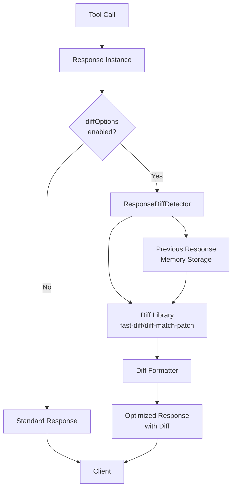

# Response Diff Detection Feature Design Doc

## 1. Overview

### 1.1 Background
The current fast-playwright-mcp returns full response content after every browser operation, resulting in redundant information for similar operations or multiple operations on the same page. This causes increased token usage and longer response processing times.

### 1.2 Purpose
- **Token Usage Reduction**: Achieve significant token reduction by returning only differences from the previous response
- **Response Efficiency**: Provide more efficient information by focusing only on changed parts
- **System Integration**: Implementation as an extension of the current expectation system

### 1.3 Scope

#### Includes
- Adding diff detection options to the expectation system
- Memory-based previous response storage functionality
- Utilizing diff libraries (diff-match-patch or fast-diff)
- Diff detection support for batch execution
- Diff display optimization

#### Excludes
- Persistent diff detection (maintaining diffs between sessions)
- Image data diff detection
- Custom diff algorithm implementation

## 2. Requirements

### 2.1 Functional Requirements

- **FR-001**: Add `diffOptions` to expectation parameters to control diff detection enable/disable
- **FR-002**: Functionality to store previous response content in memory
- **FR-003**: Response diff calculation using diff libraries
- **FR-004**: Display diff results in an understandable format (add/delete/modify)
- **FR-005**: Support diff detection for each step in batch execution
- **FR-006**: Minimum change threshold setting for small diffs

### 2.2 Non-Functional Requirements

- **NFR-001**: Performance requirement - diff calculation must complete within 100ms
- **NFR-002**: Memory usage - memory increase from storing previous responses must be within 10MB
- **NFR-003**: No impact on existing functionality - existing expectation features must be fully maintained
- **NFR-004**: Configuration flexibility - adjustable detail level for diff detection

## 3. Technical Design

### 3.1 Architecture



### 3.2 Diff Library Selection

#### Option 1: fast-diff (Recommended)
```bash
npm install fast-diff
```

**Benefits**:
- Very fast (optimized Myers algorithm)
- Lightweight (no dependencies)
- Simple API
- TypeScript support

**Usage Example**:
```typescript
import diff from 'fast-diff';

const result = diff(oldText, newText);
// result: Array<[type: -1|0|1, value: string]>
// -1: delete, 0: no change, 1: add
```

#### Option 2: diff-match-patch
```bash
npm install diff-match-patch
```

**Benefits**:
- Developed by Google, proven track record
- Feature-rich (patch application, fuzzy matching)
- Multi-language support

**Drawbacks**:
- Slightly heavier than fast-diff
- Somewhat complex API

### 3.3 Data Model

#### DiffOptions Schema
```typescript
export const diffOptionsSchema = z.object({
  enabled: z.boolean().default(false),
  threshold: z.number().min(0).max(1).default(0.1),
  format: z.enum(['unified', 'split', 'minimal']).default('unified'),
  maxDiffLines: z.number().positive().default(50),
  ignoreWhitespace: z.boolean().default(true),
  context: z.number().min(0).default(3) // Number of lines to display before and after diff
}).optional();
```

#### ResponseStorage Interface
```typescript
interface ResponseStorage {
  toolName: string;
  timestamp: number;
  content: string;
  hash: string;
}
```

### 3.4 API Design

#### New Expectation Options
```typescript
// Add to existing expectationSchema
export const expectationSchema = z.object({
  // ... existing options
  diffOptions: diffOptionsSchema
}).optional();
```

#### Usage Example
```javascript
await browser_click({
  element: 'Submit button',
  ref: '#submit',
  expectation: {
    includeSnapshot: true,
    diffOptions: {
      enabled: true,
      threshold: 0.15,
      format: 'unified',
      maxDiffLines: 30,
      context: 5
    }
  }
});
```

### 3.5 Class Design

```mermaid
classDiagram
    class ResponseDiffDetector {
        -storage: Map~string, ResponseStorage~
        -formatter: DiffFormatter
        +detectDiff(current: string, toolName: string): DiffResult
        +storeResponse(content: string, toolName: string): void
        -generateCacheKey(toolName: string): string
        -calculateDiff(old: string, new: string): DiffSegment[]
    }

    class DiffFormatter {
        +formatUnified(diff: DiffSegment[], context: number): string
        +formatSplit(diff: DiffSegment[]): string  
        +formatMinimal(diff: DiffSegment[]): string
        -highlightChanges(text: string, type: 'add'|'remove'): string
    }

    class DiffResult {
        +hasDifference: boolean
        +similarity: number
        +formattedDiff: string
        +metadata: DiffMetadata
    }

    class Response {
        +diffDetector: ResponseDiffDetector
        +serialize(): {content, isError}
        -renderWithDiff(): string
    }

    ResponseDiffDetector --> DiffFormatter
    Response --> ResponseDiffDetector
```

## 4. Implementation Plan

### 4.1 Single PR Implementation
- **Branch Name**: `feature/response-diff`
- **Content**: Complete implementation of response diff detection feature
- **Scope**:
  1. Adding fast-diff library
  2. Adding diffOptions to expectation schema
  3. Implementing ResponseDiffDetector class
  4. Implementing DiffFormatter class
  5. Integration with Response class
  6. Support for batch execution
  7. Tests and documentation

### 4.2 Implementation File List

#### New Files
- `src/utils/responseDiffDetector.ts` - Main diff detection class
- `src/utils/diffFormatter.ts` - Diff formatter
- `src/types/diff.ts` - TypeScript type definitions
- `src/__tests__/responseDiff.test.ts` - Tests

#### Modified Files
- `package.json` - Add fast-diff dependency
- `src/schemas/expectation.ts` - Add diffOptionsSchema
- `src/response.ts` - Integrate diff detection functionality
- `src/tools/batchExecute.ts` - Support batch execution
- `README.md` - Add feature description

### 4.2 Detailed Implementation Steps

#### Step 1: fast-diff Library Integration
```typescript
// src/utils/responseDiffDetector.ts
import diff from 'fast-diff';

export class ResponseDiffDetector {
  private calculateDiff(oldText: string, newText: string): DiffSegment[] {
    const result = diff(oldText, newText);
    return result.map(([type, value]) => ({
      type: type === -1 ? 'remove' : type === 1 ? 'add' : 'equal',
      value
    }));
  }
}
```

#### Step 2: Unified Format Formatter Implementation
```typescript
// src/utils/diffFormatter.ts
export class DiffFormatter {
  formatUnified(segments: DiffSegment[], context: number = 3): string {
    const lines: string[] = [];
    let inChange = false;
    
    segments.forEach((segment, index) => {
      if (segment.type !== 'equal') {
        // Include context lines before and after changes
        const prefix = segment.type === 'remove' ? '- ' : '+ ';
        lines.push(prefix + segment.value);
        inChange = true;
      } else if (inChange) {
        // Display context lines after changes
        const contextLines = segment.value.split('\n').slice(0, context);
        contextLines.forEach(line => lines.push('  ' + line));
        inChange = false;
      }
    });
    
    return lines.join('\n');
  }
}
```

## 5. Test Plan

### 5.1 Unit Tests
- **Coverage Target**: 90% or higher
- **Key Test Items**:
  - fast-diff library integration tests
  - Accuracy of various format types
  - Memory storage functionality
  - Error handling

### 5.2 Integration Tests
```typescript
describe('Response Diff Integration', () => {
  it('should detect differences using fast-diff', async () => {
    const context = createTestContext();
    
    // First response
    const response1 = new Response(context, 'browser_click', {
      expectation: { diffOptions: { enabled: true } }
    });
    response1.addResult('Page loaded successfully');
    await response1.finish();
    
    // Second response (with diff)
    const response2 = new Response(context, 'browser_click', {
      expectation: { diffOptions: { enabled: true } }
    });
    response2.addResult('Page loaded with error');
    await response2.finish();
    
    const serialized = response2.serialize();
    expect(serialized.content[0].text).toContain('- Page loaded successfully');
    expect(serialized.content[0].text).toContain('+ Page loaded with error');
  });
});
```

### 5.3 Performance Tests
- Execution within 100ms for large strings (10KB+)
- Memory usage monitoring (10MB limit verification)
- Performance impact measurement during concurrent execution

## 6. Risks and Mitigation

### 6.1 Technical Risks

| Risk | Impact | Probability | Mitigation |
|------|--------|-------------|------------|
| Library compatibility issues | Medium | Low | Pre-validation, alternative library preparation |
| Memory leaks | High | Low | Use of WeakMap, proper cleanup procedures |
| Impact on existing functionality | Medium | Low | Gradual integration, feature flag utilization |
| Diff display readability | Medium | Medium | Multiple format support, usability testing |

### 6.2 Schedule Risks
- Deep dependencies between PRs mean one PR delay affects the entire project
- Mitigation: Clarify completion criteria for each PR, parallel development when necessary

## 7. Operational Considerations

### 7.1 Monitoring Items
- Diff calculation execution time
- Memory usage trends
- Diff detection accuracy (false positive/negative)
- Token reduction rate

### 7.2 Rollback Plan
1. Disable functionality via feature flag
2. Remove expectation parameters
3. Revert to existing response format

## 8. Decision Records

### Decision 1: Diff Detection Library
- **Options**:
  - A: fast-diff (Myers algorithm)
  - B: diff-match-patch (Google)
  - C: jsdiff (feature-rich)
- **Decision**: A (fast-diff)
- **Rationale**: 
  - Fastest with best memory efficiency
  - No dependencies
  - Simple API for easy implementation

### Decision 2: Storage Method
- **Options**:
  - A: Memory-based (session only)
  - B: File-based persistence
  - C: Database usage
- **Decision**: A (Memory-based)
- **Rationale**:
  - Simple and fast
  - No file I/O overhead
  - Cross-session diff not required

### Decision 3: Expectation Integration Method
- **Options**:
  - A: Add to existing expectation
  - B: Separate as new parameter
  - C: Individual settings per tool
- **Decision**: A (Add to existing expectation)
- **Rationale**:
  - Consistency with existing system
  - Easy integration with batch execution
  - Low learning cost

## 9. Change History

| Date | Author | Changes |
|------|--------|---------|
| 2025-01-05 | Claude Code | Initial version created |
| 2025-01-05 | Claude Code | Changed diff library to fast-diff |

## 10. Approval

**Is it acceptable to proceed with this design?**

This design document implements the response diff detection feature with the following key points:

1. **Fast diff detection using fast-diff library**
2. **Complete compatibility with existing systems**
3. **Natural extension of the expectation system**
4. **Simple implementation in a single PR**

After approval, implementation will begin on the `feature/response-diff` branch.