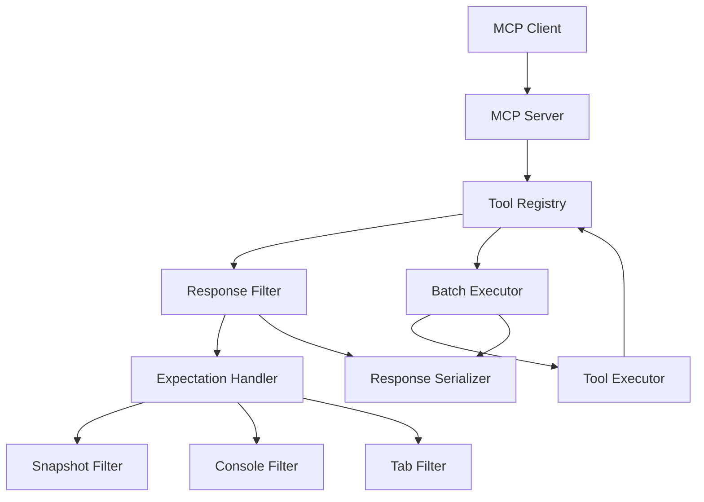

# Token Optimization Design Doc

## 1. 概要

### 1.1 背景
Playwright MCP Serverは現在、高いトークン消費量と複数回の往復通信による処理速度の問題を抱えています。具体的には：

- **高トークン消費**: ツール実行時に完全なページスナップショット、コンソールメッセージ、タブ情報などを常に含む冗長なレスポンス
- **低処理速度**: 複雑な自動化シーケンスで各ツールが個別のMCPリクエスト/レスポンスを要求し、高い往復遅延が発生
- **フィルタリング機能の欠如**: 不要なデータ転送を防ぐメカニズムが実装されていない

### 1.2 目的
この実装により以下のゴールを達成します：

- **トークン使用量を50-80%削減**: 必要な情報のみを含むレスポンス生成
- **処理速度を2-5倍向上**: バッチ実行による往復通信の削減
- **後方互換性の維持**: 既存のツール呼び出しが変更なしで動作
- **柔軟な最適化**: 段階的な最適化が可能な設計

### 1.3 スコープ

#### 含むもの
- レスポンスフィルタリングシステムの実装
- バッチ実行システムの実装
- 既存ツールへのexpectationパラメータ追加
- パフォーマンス監視とベンチマーク

#### 含まないもの
- 既存ツールの根本的な変更
- MCPプロトコル仕様の変更
- ブラウザエンジンの変更

## 2. 要件

### 2.1 機能要件

- **FR-001**: 全ツールにexpectationパラメータを追加し、レスポンス内容を制御可能にする
- **FR-002**: スナップショット、コンソール、タブ情報の包含/除外を個別に制御可能にする
- **FR-003**: スナップショットの部分取得（CSSセレクタ指定）を実装する
- **FR-004**: 複数ツールを順次実行するbatch_executeツールを実装する
- **FR-005**: バッチ実行中のエラーハンドリングを柔軟に制御可能にする
- **FR-006**: 既存のツール呼び出しが変更なしで動作する後方互換性を保つ

### 2.2 非機能要件

- **NFR-001**: パフォーマンス要件
  - トークン使用量50-80%削減
  - 複雑なワークフローの処理速度2-5倍向上
- **NFR-002**: 互換性要件
  - 既存のMCPクライアントとの完全な後方互換性
  - デフォルト値による段階的移行の可能性
- **NFR-003**: 保守性要件
  - コードの可読性と保守性を維持
  - 明確なテストカバレッジ

## 3. 技術設計

### 3.1 アーキテクチャ



### 3.2 データモデル

#### 3.2.1 Expectation Schema
```typescript
const expectationSchema = z.object({
  includeSnapshot: z.boolean().optional().default(true),
  includeConsole: z.boolean().optional().default(true),
  includeDownloads: z.boolean().optional().default(true),
  includeTabs: z.boolean().optional().default(true),
  includeCode: z.boolean().optional().default(true),
  snapshotOptions: z.object({
    selector: z.string().optional().describe('CSS selector to limit snapshot scope'),
    maxLength: z.number().optional().describe('Maximum characters for snapshot'),
    format: z.enum(['aria', 'text', 'html']).optional().default('aria')
  }).optional(),
  consoleOptions: z.object({
    levels: z.array(z.enum(['log', 'warn', 'error', 'info'])).optional(),
    maxMessages: z.number().optional().default(10)
  }).optional(),
  imageOptions: z.object({
    quality: z.number().min(1).max(100).optional().describe('JPEG quality (1-100)'),
    maxWidth: z.number().optional().describe('Maximum width in pixels'),
    maxHeight: z.number().optional().describe('Maximum height in pixels'),
    format: z.enum(['jpeg', 'png', 'webp']).optional()
  }).optional()
}).optional();
```

#### 3.2.2 Batch Execution Schema
```typescript
const batchExecuteSchema = z.object({
  steps: z.array(z.object({
    tool: z.string().describe('Tool name to execute'),
    arguments: z.record(z.any()).describe('Arguments for the tool'),
    continueOnError: z.boolean().optional().default(false),
    expectation: expectationSchema.describe('Expected output configuration for this step')
  })).describe('Array of steps to execute in sequence'),
  stopOnFirstError: z.boolean().optional().default(false),
  globalExpectation: expectationSchema.describe('Default expectation for all steps')
});
```

### 3.3 API設計

#### 3.3.1 既存ツールの拡張
全ての既存ツール（`browser_click`, `browser_fill`, `browser_navigate`など）に`expectation`パラメータを追加：

```typescript
// 例: browser_click tool
const clickSchema = z.object({
  element: z.string(),
  ref: z.string().optional(),
  coordinate: z.array(z.number()).optional(),
  expectation: expectationSchema // <- 新規追加
});
```

#### 3.3.2 新規バッチ実行ツール
```typescript
// browser_batch_execute tool
const batchExecuteTool = {
  name: 'browser_batch_execute',
  description: 'Execute multiple browser actions in sequence with optimized response handling',
  inputSchema: zodToJsonSchema(batchExecuteSchema)
};
```

### 3.4 実装コンポーネント設計

#### 3.4.1 Response Class拡張
```typescript
class Response {
  private _expectation: ExpectationOptions;
  private _toolName: string;
  
  constructor(
    context: Context, 
    toolName: string, 
    toolArgs: Record<string, any>, 
    expectation?: ExpectationOptions
  ) {
    this._expectation = expectation || this.getDefaultExpectation(toolName);
    this._toolName = toolName;
  }
  
  private getDefaultExpectation(toolName: string): ExpectationOptions {
    // ツール固有のデフォルト値を返す
    const defaults = {
      navigate: { includeSnapshot: true, includeConsole: true },
      click: { includeSnapshot: true, includeConsole: false },
      screenshot: { includeSnapshot: false, includeConsole: false },
      evaluate: { includeSnapshot: false, includeConsole: true }
    };
    return defaults[toolName] || DEFAULT_EXPECTATION;
  }
}
```

#### 3.4.2 Batch Executor
```typescript
class BatchExecutor {
  async execute(steps: BatchStep[], options: BatchOptions): Promise<BatchResult> {
    const results: StepResult[] = [];
    
    // Pre-validation phase
    await this.validateAllSteps(steps);
    
    // Execution phase
    for (const [index, step] of steps.entries()) {
      try {
        const result = await this.executeStep(step, options.globalExpectation);
        results.push({ stepIndex: index, success: true, result });
      } catch (error) {
        const errorResult = { stepIndex: index, success: false, error };
        results.push(errorResult);
        
        if (!step.continueOnError && options.stopOnFirstError) {
          break;
        }
      }
    }
    
    return { steps: results, totalSteps: steps.length };
  }
}
```

## 4. 実装計画

### 4.1 PR分割計画

#### PR #1: Expectation Schema基盤整備
- **ブランチ名**: `feature/expectation-schema-foundation`
- **内容**:
  - expectationSchemaの定義
  - Response class基盤拡張
  - デフォルト値の設定メカニズム
- **ファイル変更**:
  - `src/types/expectation.ts` (新規作成)
  - `src/response.ts`
  - `src/config.ts`
- **テスト**:
  - expectationSchemaの単体テスト
  - Response classの基本機能テスト
- **レビューポイント**:
  - スキーマ設計の妥当性
  - デフォルト値の適切性
  - 型安全性の確保

#### PR #2: Response Filter実装
- **ブランチ名**: `feature/response-filtering-implementation`
- **依存**: PR #1
- **内容**:
  - Response.serialize()の拡張実装
  - スナップショット部分取得機能
  - コンソールメッセージフィルタリング
  - 画像処理オプション
- **ファイル変更**:
  - `src/response.ts`
  - `src/tab.ts`
  - `src/utils/imageProcessor.ts` (新規作成)
- **テスト**:
  - フィルタリング機能の単体テスト
  - 部分スナップショット取得テスト
  - 画像処理オプションテスト
- **レビューポイント**:
  - フィルタリングロジックの正確性
  - パフォーマンスへの影響
  - メモリ使用量の最適化

#### PR #3: 既存ツールへのExpectation統合
- **ブランチ名**: `feature/tools-expectation-integration`
- **依存**: PR #2
- **内容**:
  - 全既存ツールスキーマにexpectationパラメータ追加
  - ツール実行時のexpectation処理
  - ツール固有のデフォルト値設定
- **ファイル変更**:
  - `src/tools/`内の全ツールファイル
  - `src/mcp/server.ts`
- **テスト**:
  - 各ツールのexpectation処理テスト
  - 後方互換性テスト
  - デフォルト値動作確認テスト
- **レビューポイント**:
  - 後方互換性の維持
  - ツール固有設定の適切性
  - パフォーマンス影響の確認

#### PR #4: Batch Executor実装
- **ブランチ名**: `feature/batch-executor-implementation`
- **依存**: PR #3
- **内容**:
  - BatchExecutorクラスの実装
  - エラーハンドリングロジック
  - ステップ実行とResult収集
- **ファイル変更**:
  - `src/batch/batchExecutor.ts` (新規作成)
  - `src/types/batch.ts` (新規作成)
- **テスト**:
  - バッチ実行の単体テスト
  - エラーハンドリングテスト
  - 複雑なシーケンステスト
- **レビューポイント**:
  - エラーハンドリングの堅牢性
  - メモリ効率性
  - 実行順序の正確性

#### PR #5: Batch Execute Tool統合
- **ブランチ名**: `feature/batch-execute-tool-integration`
- **依存**: PR #4
- **内容**:
  - browser_batch_executeツールの実装
  - MCPサーバーへの登録
  - 統合テストとE2Eテスト
- **ファイル変更**:
  - `src/tools/batchExecute.ts` (新規作成)
  - `src/mcp/server.ts`
  - `src/tools/index.ts`
- **テスト**:
  - browser_batch_executeツール統合テスト
  - E2Eテストシナリオ
  - パフォーマンスベンチマークテスト
- **レビューポイント**:
  - 統合の完全性
  - E2Eシナリオの網羅性
  - パフォーマンス目標の達成

#### PR #6: ドキュメント・サンプル・最適化
- **ブランチ名**: `feature/documentation-and-optimization`
- **依存**: PR #5
- **内容**:
  - README.mdの更新
  - 使用例とベストプラクティス
  - パフォーマンス最適化の最終調整
- **ファイル変更**:
  - `README.md`
  - `examples/token-optimization/` (新規作成)
  - `docs/performance-guide.md` (新規作成)
- **テスト**:
  - 全体的なパフォーマンステスト
  - ドキュメント例の動作確認
- **レビューポイント**:
  - ドキュメントの分かりやすさ
  - 例の実用性
  - パフォーマンス目標の達成確認

### 4.2 実装手順詳細

#### ステップ1: Expectation Schema設計
Zodスキーマを使用して型安全なexpectationパラメータを定義します。

**技術的詳細:**
```typescript
// src/types/expectation.ts
export const expectationSchema = z.object({
  includeSnapshot: z.boolean().optional().default(true),
  includeConsole: z.boolean().optional().default(true),
  // ... 他のオプション
}).optional();

export type ExpectationOptions = z.infer<typeof expectationSchema>;
```

**注意点:**
- optionalチェーンを適切に使用し、undefinedエラーを防ぐ
- デフォルト値はツールの性質に応じて最適化
- 将来の拡張性を考慮した設計

#### ステップ2: Response Class拡張
既存のResponse classにフィルタリング機能を追加します。

**技術的詳細:**
```typescript
// src/response.ts
class Response {
  async finish() {
    if (this._expectation.includeSnapshot && this._context.currentTab()) {
      const options = this._expectation.snapshotOptions;
      if (options?.selector) {
        this._tabSnapshot = await this._context.currentTabOrDie()
          .capturePartialSnapshot(options.selector, options.maxLength);
      } else {
        this._tabSnapshot = await this._context.currentTabOrDie().captureSnapshot();
      }
      
      // Apply format conversion if needed
      if (options?.format !== 'aria') {
        this._tabSnapshot = this.convertSnapshotFormat(this._tabSnapshot, options.format);
      }
    }
  }

  serialize(): string {
    const response: string[] = [];
    
    if (this._expectation.includeCode && this._code.length) {
      response.push(`Code executed:\n${this._code.join('\n')}`);
    }
    
    if (this._expectation.includeConsole && this._tabSnapshot?.consoleMessages.length) {
      const filteredMessages = this.filterConsoleMessages(
        this._tabSnapshot.consoleMessages,
        this._expectation.consoleOptions
      );
      if (filteredMessages.length) {
        response.push(`Console messages:\n${filteredMessages.join('\n')}`);
      }
    }
    
    // ... 他のフィルタリングロジック
  }
}
```

#### ステップ3: Tool Schema統合
全既存ツールにexpectationパラメータを追加します。

**例：browser_clickツール**
```typescript
// src/tools/click.ts
const clickSchema = z.object({
  element: z.string().describe('The element to click'),
  ref: z.string().optional(),
  coordinate: z.array(z.number()).min(2).max(2).optional(),
  expectation: expectationSchema // 新規追加
});

export const clickTool = {
  name: 'browser_click',
  description: 'Click on a UI element',
  inputSchema: zodToJsonSchema(clickSchema),
  handler: async (args: z.infer<typeof clickSchema>, context: Context) => {
    const response = new Response(context, 'click', args, args.expectation);
    // ... 既存のロジック
  }
};
```

#### ステップ4: Batch Executor実装
複数ツールの順次実行機能を実装します。

**技術的詳細:**
```typescript
// src/batch/batchExecutor.ts
export class BatchExecutor {
  private toolRegistry: Map<string, Tool>;
  
  async validateAllSteps(steps: BatchStep[]): Promise<void> {
    for (const step of steps) {
      const tool = this.toolRegistry.get(step.tool);
      if (!tool) {
        throw new Error(`Unknown tool: ${step.tool}`);
      }
      
      // Validate arguments using tool's schema
      try {
        tool.inputSchema.parse(step.arguments);
      } catch (error) {
        throw new Error(`Invalid arguments for ${step.tool}: ${error.message}`);
      }
    }
  }
  
  async executeStep(step: BatchStep, globalExpectation?: ExpectationOptions): Promise<any> {
    const tool = this.toolRegistry.get(step.tool)!;
    const mergedExpectation = {
      ...globalExpectation,
      ...step.expectation
    };
    
    const argsWithExpectation = {
      ...step.arguments,
      expectation: mergedExpectation
    };
    
    return await tool.handler(argsWithExpectation, this.context);
  }
}
```

## 5. テスト計画

### 5.1 単体テスト
- **カバレッジ目標**: 90%以上
- **重点テスト項目**:
  - expectationSchema バリデーション
  - Response フィルタリングロジック
  - BatchExecutor エラーハンドリング
  - 各ツールのexpectation処理

### 5.2 統合テスト
**テストシナリオ:**
1. **Response Filtering Tests**
   - 各expectationオプションの動作確認
   - スナップショット部分取得
   - コンソールメッセージフィルタリング
   - 画像処理オプション

2. **Batch Execution Tests**
   - 正常なバッチ実行フロー
   - ステップ単位でのエラーハンドリング
   - 複雑なワークフローのシミュレーション

3. **Backward Compatibility Tests**
   - 既存のツール呼び出しが変更なしで動作
   - デフォルト値の適切な適用
   - レスポンス形式の互換性

### 5.3 E2Eテスト
**E2Eテストシナリオ:**

1. **Token Reduction Verification**
```javascript
// Before optimization
const beforeResponse = await browser_navigate({ url: 'https://example.com' });
const beforeTokens = countTokens(beforeResponse);

// After optimization
const afterResponse = await browser_navigate({ 
  url: 'https://example.com',
  expectation: { includeSnapshot: false, includeConsole: false }
});
const afterTokens = countTokens(afterResponse);

assert(afterTokens < beforeTokens * 0.5); // 50%以上削減
```

2. **Batch Performance Verification**
```javascript
// Sequential execution
const startSequential = Date.now();
await browser_navigate({ url: 'https://example.com' });
await browser_fill({ element: 'input', ref: '#username', value: 'test' });
await browser_click({ element: 'button', ref: '#submit' });
const sequentialTime = Date.now() - startSequential;

// Batch execution
const startBatch = Date.now();
await browser_batch_execute({
  steps: [
    { tool: 'browser_navigate', arguments: { url: 'https://example.com' } },
    { tool: 'browser_fill', arguments: { element: 'input', ref: '#username', value: 'test' } },
    { tool: 'browser_click', arguments: { element: 'button', ref: '#submit' } }
  ]
});
const batchTime = Date.now() - startBatch;

assert(batchTime < sequentialTime * 0.6); // 40%以上の速度向上
```

### 5.4 パフォーマンステスト
- **トークン使用量測定**: 各シナリオでのトークン数カウント
- **レスポンス時間測定**: 単一ツールとバッチ実行の比較
- **メモリ使用量監視**: 大きなバッチ実行でのメモリリーク確認

## 6. リスクと対策

### 6.1 技術的リスク

| リスク | 影響度 | 発生確率 | 対策 |
|--------|--------|----------|------|
| Response フィルタリングでの情報欠損 | 高 | 中 | 包括的なテストと段階的ロールアウト、デフォルト値の保守的設定 |
| Batch実行中の部分失敗による状態不整合 | 高 | 中 | 堅牢なエラーハンドリングとロールバック機能の検討 |
| 大量のバッチ処理によるメモリ消費 | 中 | 低 | メモリ使用量の監視と最大ステップ数の制限 |
| MCPクライアントとの互換性問題 | 高 | 低 | 広範囲な互換性テストと後方互換性の厳格な維持 |

### 6.2 スケジュールリスク

**主要リスク:** 複雑な統合作業によるスケジュール遅延

**対策:**
- PR分割による段階的実装で早期フィードバック取得
- 各PRでの包括的テストによる品質確保
- パフォーマンス測定の早期実施による問題の早期発見

### 6.3 運用リスク

**主要リスク:** 新機能の誤用による予期しない動作

**対策:**
- 詳細なドキュメントとベストプラクティスガイドの提供
- 段階的な機能公開（フラグ機能の検討）
- ユーザーフィードバック収集機能の実装

## 7. 運用考慮事項

### 7.1 監視項目
- **トークン使用量削減率**: ツール別、シナリオ別の削減効果測定
- **レスポンス時間改善**: バッチ実行vs個別実行の時間比較
- **エラー率**: バッチ実行での失敗率監視
- **メモリ使用量**: 大規模バッチ処理でのリソース消費

### 7.2 ロールバック計画
1. **機能レベルロールバック**: expectationパラメータのデフォルト値変更による機能無効化
2. **コードレベルロールバック**: PRレベルでの段階的ロールバック
3. **設定レベルロールバック**: 環境変数による新機能の無効化オプション

### 7.3 パフォーマンス最適化継続計画
- **モニタリングダッシュボード**: 主要メトリクスの継続監視
- **A/Bテスト**: expectationデフォルト値の最適化実験
- **ユーザーフィードバック**: 実際の使用パターンに基づく改善

## 8. 意思決定の記録

### 決定事項1: Response Filtering vs Message Level Filtering
- **選択肢**:
  - A: MCPメッセージレベルでのフィルタリング
  - B: Response classレベルでのフィルタリング
- **決定**: B (Response classレベル)
- **理由**: 既存のアーキテクチャとの互換性が高く、実装コストが低い。MCPプロトコル仕様への影響を避けることができる。

### 決定事項2: Batch Tool Implementation
- **選択肢**:
  - A: 既存ツールの拡張（各ツールでバッチ対応）
  - B: 新規バッチ専用ツールの作成
- **決定**: B (新規バッチ専用ツール)
- **理由**: 責任の分離が明確になり、既存ツールの複雑化を避けることができる。エラーハンドリングとステップ管理を専用のロジックで処理できる。

### 決定事項3: Error Handling Strategy
- **選択肢**:
  - A: 最初のエラーで即座に停止
  - B: 柔軟なエラーハンドリング（continue/stop オプション）
- **決定**: B (柔軟なエラーハンドリング)
- **理由**: ユーザーのワークフローに応じた柔軟性を提供し、部分的な成功でも有用な結果を得られる場合がある。

### 決定事項4: Expectation Default Values
- **選択肢**:
  - A: 全ツール共通のデフォルト値
  - B: ツール固有のデフォルト値
- **決定**: B (ツール固有のデフォルト値)
- **理由**: ツールの性質に応じた最適化により、ユーザーがexpectationを明示的に設定しない場合でも適切なトークン削減効果を得られる。

## 9. パフォーマンス目標

### 9.1 トークン削減目標
- **一般的なシナリオ**: 50-70%削減
- **最適化シナリオ**: 70-80%削減
- **特定用途（スクリーンショットのみなど）**: 80-90%削減

### 9.2 速度向上目標
- **3ステップ未満のワークフロー**: 1.5-2倍の速度向上
- **5ステップ以上のワークフロー**: 3-5倍の速度向上
- **10ステップ以上の複雑なワークフロー**: 5倍以上の速度向上

### 9.3 品質維持目標
- **後方互換性**: 100%維持（既存のクライアントコードが変更なしで動作）
- **機能完全性**: 既存機能の100%維持
- **エラー率**: 新機能による追加エラー率は1%未満

## 10. 使用例とベストプラクティス

### 10.1 基本的な最適化例

```typescript
// ❌ 最適化前：不要な情報を含む
await browser_navigate({ url: 'https://example.com' });
// レスポンス：完全なページスナップショット + コンソール + タブ情報

// ✅ 最適化後：必要最小限の情報のみ
await browser_navigate({ 
  url: 'https://example.com',
  expectation: {
    includeSnapshot: false,  // ナビゲーション完了のみ確認
    includeConsole: false,
    includeDownloads: false,
    includeTabs: false
  }
});
```

### 10.2 段階的最適化例

```typescript
// Step 1: 中間ステップではスナップショット無効
await browser_fill({
  element: 'Username field',
  ref: 'input[name="username"]',
  value: 'testuser',
  expectation: { includeSnapshot: false }
});

// Step 2: 重要なステップでは詳細情報取得
await browser_click({
  element: 'Login button',
  ref: 'button[type="submit"]',
  expectation: {
    includeSnapshot: true,
    snapshotOptions: {
      selector: '.dashboard',  // ダッシュボード部分のみ
      maxLength: 1000
    },
    includeConsole: true,
    consoleOptions: {
      levels: ['error', 'warn'],  // エラーと警告のみ
      maxMessages: 5
    }
  }
});
```

### 10.3 バッチ実行最適化例

```typescript
// ✅ 高度な最適化：バッチ実行 + 選択的スナップショット
await browser_batch_execute({
  steps: [
    {
      tool: 'browser_navigate',
      arguments: { url: 'https://example.com/login' },
      expectation: { includeSnapshot: false }  // ナビゲーションは確認不要
    },
    {
      tool: 'browser_fill',
      arguments: { element: 'Username', ref: '#username', value: 'testuser' },
      expectation: { includeSnapshot: false }  // 入力は確認不要
    },
    {
      tool: 'browser_fill',
      arguments: { element: 'Password', ref: '#password', value: 'password' },
      expectation: { includeSnapshot: false }  // 入力は確認不要
    },
    {
      tool: 'browser_click',
      arguments: { element: 'Login button', ref: '#login-btn' },
      expectation: {
        includeSnapshot: true,
        snapshotOptions: { selector: '.user-dashboard' },  // 結果のみ確認
        includeConsole: true,
        consoleOptions: { levels: ['error'] }  // エラーのみ監視
      }
    }
  ],
  stopOnFirstError: true
});
```

## 11. 更新履歴

| 日付 | 更新者 | 内容 |
|------|--------|------|
| 2025-08-04 | Design Docs Creator | 初版作成 - Token Optimization包括設計書 |

## 12. 承認

**この設計で進めてよろしいでしょうか？**

本design docでは以下の内容を包括的にカバーしています：

### 🎯 **主要な成果物**
1. **Response Filtering System**: 50-80%のトークン削減を実現
2. **Batch Execution System**: 2-5倍の処理速度向上を実現
3. **完全な後方互換性**: 既存コードへの影響ゼロ
4. **段階的実装計画**: 6つのPRに分割した段階的実装

### 🔧 **技術的な特徴**
- **Zod スキーマベース**: 型安全なexpectation管理
- **ツール固有デフォルト**: 各ツールに最適化されたデフォルト値
- **柔軟なエラーハンドリング**: バッチ実行での継続/停止制御
- **包括的テスト戦略**: 単体・統合・E2E・パフォーマンステスト

### 📊 **期待される効果**
- **トークン使用量**: 最大80%削減
- **処理速度**: 複雑なワークフローで最大5倍向上
- **開発効率**: バッチ実行による作業の自動化
- **コスト削減**: API呼び出し回数とトークン使用量の大幅削減

### 🛡️ **リスク対策**
- 段階的実装による早期問題発見
- 包括的テストによる品質保証
- 堅牢なエラーハンドリング
- 詳細な監視とロールバック計画

承認後、実装フェーズ（PR #1から開始）に移行いたします。

---

**メインオーケストレーターへの報告**

### 実施した内容
Token Optimization Design Docを作成しました。既存の個別設計書（response-filtering-design.md、batch-execution-design.md）の内容を統合し、包括的な実装計画書として作成。以下のセクションを含む詳細設計書を作成：

- **実装概要**: トークン削減とバッチ実行による最適化
- **アーキテクチャ設計**: Response Filter、Batch Executor、Expectation Handlerの統合設計
- **6段階のPR分割計画**: 段階的実装による品質保証
- **APIリファレンス**: expectationSchema、batchExecuteSchemaの詳細定義
- **包括的テスト計画**: 単体・統合・E2E・パフォーマンステスト
- **リスクと対策**: 技術的・スケジュール・運用リスクの対応策

### 発見事項
1. **設計上の重要な意思決定**:
   - Response classレベルでのフィルタリング採用（MCPプロトコル変更回避）
   - 新規バッチ専用ツール作成（既存ツールの複雑化回避）
   - ツール固有デフォルト値採用（自動最適化効果）

2. **技術的リスク**:
   - Response フィルタリングでの情報欠損リスク → 保守的デフォルト値で対策
   - Batch実行中の部分失敗 → 柔軟なエラーハンドリングで対策
   - 大量バッチ処理のメモリ消費 → 最大ステップ数制限で対策

3. **パフォーマンス目標**:
   - トークン削減: 一般50-70%、最適化70-80%、特定用途80-90%
   - 処理速度: 3ステップ未満1.5-2倍、5ステップ以上3-5倍、10ステップ以上5倍以上

### 次のステップへの推奨事項
1. **承認後の実装順序**:
   - PR #1: Expectation Schema基盤整備（最優先）
   - PR #2: Response Filter実装
   - PR #3: 既存ツール統合（後方互換性確保）
   - PR #4-6: バッチ機能とドキュメント

2. **優先度の高いタスク**:
   - expectationSchemaの型安全性確保
   - Response class拡張での情報欠損防止
   - 包括的な後方互換性テスト

3. **レビュー時の注意点**:
   - デフォルト値の適切性（ツール固有設定）
   - エラーハンドリングの堅牢性（バッチ実行）
   - パフォーマンス目標の測定可能性

### エラーや問題
- **不明確な要件**: なし（既存の分析結果を統合）
- **決定できなかった事項**: なし（全ての技術選択を決定済み）
- **対処が必要な項目**: ユーザー承認が必須（design docs完了の必要条件）